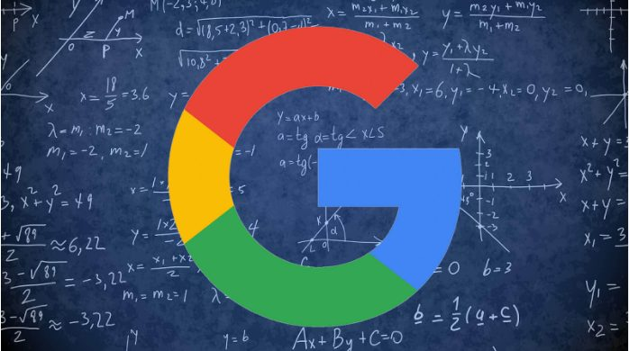

Desde mediados de los 90 cuando el e-commerce empezó a tener cada vez más auge, los expertos determinaron que necesitaban generar tráfico web para ganar clientes, por lo tanto, se desarrollaron los motores de búsqueda y uno de los más conocidos es precisamente Google.

**Desde ese mismo instante el SEO había nacido, y es la estrategia de marketing más usada en la actualidad,** y es que gracias a la comprensión de los algoritmos de búsqueda y al trabajo duro, pueden alcanzarse los primeros lugares en los motores de búsqueda.

Puede que el SEO haya optimizado la forma de comercializar, y es por eso que **son más los negocios que se suman a esta alternativa como herramienta en un mercado globalizado por Internet.**

## La importancia de un buen SEO

**El posicionamiento es la razón más importante para hacer provechosa una página web** para los usuarios y para su posicionamiento en Google, porque gracias a esto, los motores de búsqueda pueden determinar si la información es relevante y útil para el público, y mediante algoritmos determinar de qué trata el sitio web.

En vista de las grandes ventajas que garantiza el [posicionamiento web SEO](https://eidosdesarrolloweb.com/posicionamiento-seo/), paulatinamente **aumentan las cifras de empresas que contratan servicios de profesionales para conocer las debilidades de sus plataformas y transformarlas en un tráfico más orgánico.**

L**a clave de todo este proceso es el contenido**, y basándose en esto, los motores de búsqueda aplican:

- **Rastreo**: mientras se mantenga una buena estructura de enlaces, los bots tendrán un mejor recorrido para navegar y conseguir el contenido solicitado. Una vez recopilados todos los datos que proporciona el servidor, se hace un análisis de los sitios nuevos y cambios más recientes.
- **Indexación:** una vez recopilada toda la información requerida, son incluidas las páginas en el índice y clasificadas según el contenido, relevancia y autoridad. Así los resultados que se visualizan son aquellos con mayor similitud para la consulta.

## Cinco pasos para posicionar una página web

Por lo general, en los últimos años, el SEO es la opción favorita de pequeñas y grandes empresas, por eso, **las agencias de marketing han sido indispensables en los cambios del mercado**, y es que profesionales como [Eidos Desarrollo Web](https://eidosdesarrolloweb.com/) tienen las herramientas para hacer frente a nuevos retos para aumentar la visualización de una empresa.

**El marketing digital implica una serie de pasos que requieren ser aplicados uno tras otro para alcanzar un objetivo,** por eso los profesionales en el área sugieren realizar estos pasos para alcanzar un lugar top en Google.

### El index

Muchos blogs pierden posición en Google porque **los bots suelen consumir bastante tiempo en la búsqueda con información que no es relevante y de interés para el usuario**, y todo se debe a que la maqueta del sitio está desarrollada para indexar contenido y no para rankear.

Si se desea evitar esto, existe una configuración sencilla en WordPress, por ejemplo, que cambia la forma tradicional de ingresar con unos pocos clics.

### Enlaces internos y externos

Los motores de búsqueda de Google tienen algoritmos también para encontrar **los enlaces internos con “no follow” con menor frecuencia**, pero el público no tendrá interacción alguna en el sitio, ocasionando la pérdida de posicionamiento.

Por eso, **se recomienda incluir banners o enlaces con las redes sociales de la empresa que ayuden a generar el interés en los clientes potenciales.**

### Palabras clave

Una de las cosas más difíciles de determinar es el uso de las _palabras claves (keywords)_, porque tal y **cómo lo escriba el consumidor, será esencial para activar el buscador**, y esto lo convierte en el factor más importante de todo el proceso.

De hecho, **ya existen aplicaciones que notifican si el resultado será óptimo o no**, puede que no se determine el número exacto de búsquedas, pero sí ofrece una idea para configurarla de la mejor manera posible.

### Tráfico web

Para generar tráfico hacia un sitio web de forma gratuita, se recomienda el uso de enlaces una vez estudiada la competencia y atendiendo a la cantidad de dinero para invertir en esta alternativa. **Uno de los primeros enlaces a utilizar serán las redes sociales de la empresa.**

### La fidelidad

Definir el tipo de cliente que puede tener un negocio es todo un enigma, no obstante, **con algunas técnicas se puede ganar la fidelidad de clientes potenciales y todo gracias a la creación de contenido original** con el que se sienta atraído y despierte su curiosidad por adquirir más productos.

Una vez se consigue la fidelidad del público objetivo, se requiere que sigan ingresando en la web, **esto puede lograrse con estrategias llamativas que no perjudiquen la rentabilidad de la empresa y este tráfico orgánico será un motivo de obtener buena relevancia a través de un mejor posicionamiento en los motores de búsqueda de Google.**
