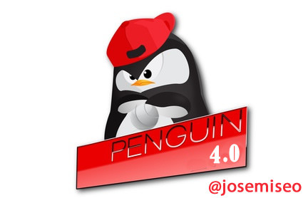
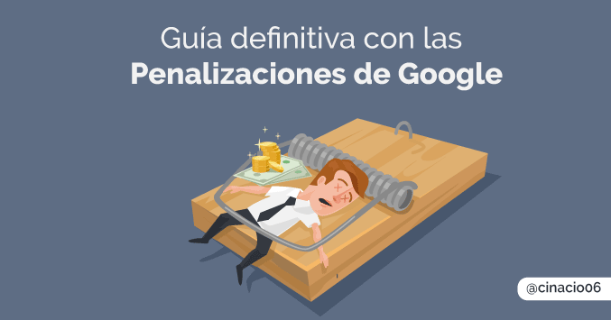

Bueno aquí estoy un viernes por la noche escribiendo el post sobre la actualización de Google pingüino de hoy 23 de septiembre, esta vez si es oficial, les ha costado poder **integrar el Algoritmo de Penguin en el Core del buscador** pero definitivamente lo tenemos on fire ! Os hago una breve introducción del pingüino y me pongo al tema

## Que es Google Penguin

Así de forma rápida para los que no lo conozcáis es un algoritmo de Google que se encarga de evaluar la calidad los enlaces entrantes que entran hacia nuestra web, ya que los SEO de la vieja escuela abusaban del spameo con enlaces de todo tipo hacia las webs que querían posicionar, entonces Google saco la Guadaña y dejo tieso a mas de uno.

### Factores que tiene en Cuenta Penguin

Así ha groso modo sin entrar en la complejidad del análisis del Algoritmo, Penguin tiene en cuenta factores como la frescura del contenido que nos enlaza y sus anchors (si tenéis muchos enlaces que sean de marca personal el pinguinito se suele portar bien) , también se fija mucho en el lugar desde nos enlazan (Pais) y en el [Pagerank](https://es.wikipedia.org/wiki/PageRank) ( Oye que ya no existe el pagerank! Que si existe…que google no muestre el pagerank no quiere decir que no lo actualice internamente )

## Que significa que google Penguin se integra en el Core del Algoritmo de Búsqueda

Pues significa que desde hoy mismo pasa a formar parte del algoritmo básico de Google y se ejecutará de manera permanente , así que nos estará dando por saco a full time

Pues así a vote pronto nos va impedir monetizar tan rápido de manera blackhatera los blogs propios, pero hoy en el informe de keywords de hace un rato de los blogs maléficos no he notado mucho cambio pero supongo que no tardará mucho en dar las primeras picotadas, no se el alcance que puede tener a ese nivel, porque que se ejecute continuamente no tiene que ver con que haya mejorado y pueda analizar más niveles de enlaces mas rápido. Bueno aquí os pongo las ventajas y los inconvenientes que veo en esta actualización, tampoco es todo malo ya que si se ejecuta continuamente podemos ir probando a ver que comportamientos le hacen saltar y no tenemos que esperar a que vuelva a pasar para saber si estamos o no haciendo algo mal y seguro que [Chuiso](http://chuiso.com/)(que es un mal que nunca duerme jeje) encuentra un patrón rápidamente xD y nos cuenta alguna de sus batallas.

Desde luego cambiará la forma de hacer blackhat, esperaré que se pronuncie alguno de los cracks especialistas en blackhat porque para mi son los que más controlan en penguin, ya que tienen muchos blogs TIER y PBNs que serán afectadas y también estoy seguro que levantarán la penalización, ya que existen muchas más factores que nos ayudan a posicionar un proyecto y tienen experiencia en el tema

### Inconvenientes de la integración de Pinguïno

\-Penalizaciones Algorítmicas diarias

\-Va ser más complicado monetizar un proyecto rápidamente

### Ventajas de la integración de Pinguïno

Actualización casi diaria de los sitios afectados por penguin

Podemos levantar la penalización más rápido ya que podemos acotar más fácilmente los enlaces causantes de la penalización

Devalua el correo no deseado que detecte como spam y esto ya no afecta a la clasificación del sitio web

Nos puede ayudar a detectar rápidamente los enlaces malos por cambios bruscos de ciertas palabras clave

## [Leer mas en el Blog de Webmasters de Google](https://webmasters.googleblog.com/2016/09/penguin-is-now-part-of-our-core.html)

## [Todo lo que tienes que saber sobre las penalizaciones de Google](http://claudioinacio.com/2016/09/20/penalizacion-de-google-guia-completa/)

