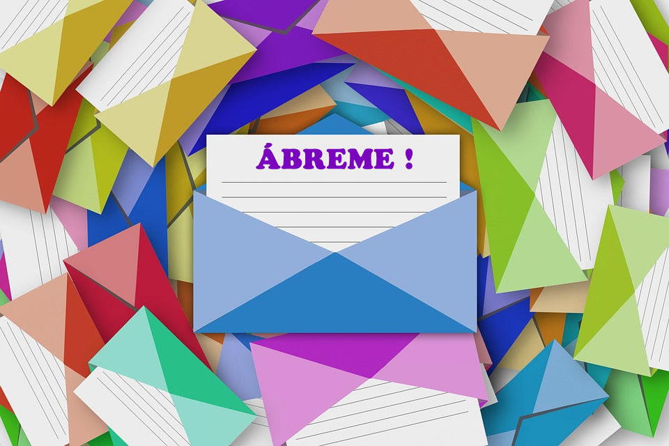

# Asuntos para tu estrategia de email Marketing
Cada vez es más usual que las empresas integren en su [estrategia de inbound marketing](https://www.gesdiweb.es/inbound-marketing/) el email marketing. Da igual si se trata de grandes compañías o una pequeña: todas conocen el email marketing e intuyen los beneficios que pueden tener, siendo [Mailchimp una de las herramientas de email marketing mas conocidas.](http://mailchimp.com/)

El único [hándicap del email marketing](https://www.gesdiweb.es/email-marketing/) es que **el lector solo ve los asuntos para tus mails que escribes**, por lo que hacerlo de una forma diferente es lo único que te asegurará el éxito de apertura. Así que, aunque tu email tenga un contenido precioso y divino, si el asunto del mail no es realmente llamativo no tienes nada que hacer.

Hay muchas formas de escribir asuntos para tus mails, por eso te descubrimos **tres tipos de asuntos para tus mails que darán los resultados que esperas.**

## 3 tipos de mensajes para tus mails de Marketing

### El asunto exagerado
Aunque no lo parezca, este tipo **de asuntos para tus mails funcionan muy bien y son bastante clásicos**. En general, añadir datos exagerados y algún pequeño gancho hará que tus lectores se sientan mucho más atraídos para abrir el mail, claro que acceder a tu web dependerá del contenido que tenga.

Una de las cosas más importantes es que hay que añadir cifras, teniendo en cuenta lo que puedes ofrecer y lo que más les gusta a tu lista de suscriptores. Tienen un buen porcentaje de éxito ya que aunque al principio no se crea el asunto del mail, la curiosidad hará el resto.

Un ejemplo de este tipo de asuntos para tus mails puede ser “Compra uno y llévate el segundo, GRATIS”.

### El asunto amigable
Uno de los mayores éxitos con un asunto así en una campaña de email marketing fue el de Obama. Su email solo tenía como asunto algo muy sencillo, una única palabra: “Hey”. Esta campaña, generó más de 690 millones de dólares de financiación y una tasa de apertura del 80%.

Los **asuntos para tus mails amigables, cordiales, relajados y en los que prácticamente no se dice nada del contenido que hay dentro**, son bastante mucho más insistentes que cualquier otro tipo de asuntos. Esto se debe a que se crea una expectación en el lector, por lo que este se siente atraído por el contenido y esto hace aumentar la tasa de apertura. El único problema que podéis tener con este tipos de asuntos es que a veces no funcionan del todo bien ya que se envían a suscriptores que no esperan este tipo de contenidos.

Un ejemplo puede ser algo como “¿Te ayudo?”

### El asunto gracioso
¿Quién no ha sonreído alguna vez al ver el asunto de un mail? Los consumidores están muy condicionados con el tema del email marketing y ya saben lo que quieren las empresas: que compren. Por eso, a veces, cuando les proporcionamos ese tipo de descanso emocional, sin presionarlos, se sienten más cómodos con los emails de las marcas. **Los asuntos para tus mails graciosos pueden ser tu arma para llamar la atención de tus clientes.**

El humor ayuda a dar cercanía al correo y que se genere una relación y conversación informal entre cliente y marca. Por eso, comentamos que un mail gracioso puede ser la mejor de las maneras para que tu cliente baje las defensas y se interne en tu publicidad.

Un ejemplo para este mail puede ser perfectamente “Darte un capricho no es ningún delito”.
