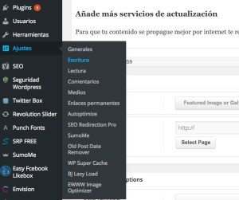

# 7 consejos para conseguir más visitas en tu blog
Ya os comentamos que **no es fácil crear un blog corporativo** con un **[buen diseño web](https://www.gesdiweb.es/)** en el que hablar de vuestra marca y de temas relevantes del sector en el que os movéis. Pues bien, si esto ya es complicado, **el tema de conseguir visitas y convertir esto en dinero, ¡lo es más todavía!** 

Cuando **un blog no recibe suficientes visitas** para [**monetizar**](https://www.gesdiweb.es/adsensei-monetizar-adsense/) o simplemente para poder difundir el contenido que tanto os está costando desarrollar, suelen darse dos situaciones: **rendirse o seguir luchando por mejorar.**

Está claro que con lo que **cuesta sacar adelante los contenidos** para un blog, solo nos falta que **nadie lo lea o que tengamos tan solo un grupo muy reducido de visitantes.** Este problema se puede solucionar y se pueden **aumentar las visitas en el blog**, pero por supuesto hay que **saber por qué** no tenemos el nivel de visitas en el blog que nosotros queremos.

## ¿Por qué no tienes suficientes visitas en el blog o en tu web?
Existen **muchos motivos que hacen que tu blog apenas tenga visitas** en el blog y que esto te frustre un poco –aunque ya sabemos que a algunos bastante más que a otros-. El tema es que **normalmente no hay solo un motivo** por el que tu blog no recibe visitas, sino que suele ser una convergencia de pequeñas cosas las que llevan a tus posibles lectores a no entrar en tu blog. Estos son algunos de los por qué no tienes visitas en el blog –o al menos las que te gustaría tener-.

**El contenido no es relevante**: Pasa constantemente.. A veces, por mucho que trabajes los contenidos es muy posible que no sean tan interesantes como vosotros pensáis.

**No trabajas la difusión en redes sociales**: Es muy importante que el esfuerzo que haces en crear el contenido, trabajes el hecho la difusión de tu trabajo, ¡Comparte, comparte, comparte!. Estas seguro que no cometes [errores en redes sociales](https://www.gesdiweb.es/redes-sociales-errores/ "Los errores más comunes en redes sociales")

**Te limitas a un solo público**: A veces, nuestro target puede ser mucho más amplio de lo que nos planteamos al principio. ¡No te cierres puertas y aumenta las visitas en el blog!

**Porque no es [mobile friendly](https://www.gesdiweb.es/mobile-friendly/ "Mobile Friendly, ¿sí o no?")**: A veces, las pocas visitas en el blog se debe a que el diseño del blog, el tiempo de cargas, la adaptación a diferentes tamaños de pantalla, etc., consigue que los posibles lectores abandonen tu blog y recurran a otro.

### [Aprovecha las herramientas gratuitas de Google](http://www.kupakia.com/herramientas-google-marketing/)

Parece una cosa obvia no? . Pues os sorprenderías de la gente que empieza un blog y no realiza ni las tareas básicas para controlar la progresión de su web. En primer lugar date de alta en **[Analytics](https://analytics.google.com/analytics/web/) ,** necesitaras una cuenta de gmail que te valdrá para todos los procesos de configuración.En definitiva no intentes empezar la casa por el tejado, tener acceso a la analítica de tu web es fundamental, los hosting no proporcionan información fiable de tus visitas, realiza vistas en analytics

Una vez estés dado de alta en Analytics, crea las diferentes vistas de tu blog en **[search console](https://www.google.com/webmasters/#?modal_active=none) y configúralo correctamente:** idioma, dominio preferido, sube el **archivo robots.txt** y envía el sitemap, si no tienes sitemap y no sabes crearlo, plugins como Yoast te lo generan automáticamente, también hay herramientas de generación automática si no gastáis WordPress, pero si queréis algo profesional no recomiendo otro CMS.

Estas cosas que he mencionado son los pilares de vuestro blog, si configuras correctamente estas herramientas tendrás una buena base para empezar a trabajar el SEO de vuestra web, títulos, descripciones etc, os sorprenderías de mucha gente que publica en teoría cosas técnicas y se las dan de gurus y no tiene el archivo robots.txt bien configurado y no sabe que es search console ni mucho menos lo tiene configurado

### [Organiza los contenidos](https://www.gesdiweb.es/estrategia-de-contenidos/)
Es muy importante que **seas capaz de crearte un plan de contenidos**. Si no sabes qué vas a escribir cada día, ¿cómo vas a motivarte a hacerlo? Hay que trabajar muy bien la organización en lo que es el tema del marketing de contenidos.

Además, es muy importante que trabajemos distintos formatos dentro del propio blog, como el texto, los vídeos, los enlaces, etc. Todo eso suma y por supuesto nos ayudará a demostrar que sabemos lo que hacemos.

### [Convierte a tus lectores en tus embajadores](https://www.gesdiweb.es/atencion-cliente-redes-sociales/)
No hay **nada mejor como el boca a boca**, y eso es así. Lo más importante a la hora de **trabajar la marca en Internet** es que es muy importante que nuestros **lectores sean nuestro punto de apoyo más importante**. Por eso, **céntrate** en **hacer** lo que **más** **les** **gusta**: crea post específicos con sus dudas o miedos, pregunta qué quieren leer y escríbelo, analiza los comentarios de tu blog para saber en qué puedes mejorar y cómo hacerlo…

### [Cámbiale la apariencia a tu blog](https://www.gesdiweb.es/diseno-web-efectivo-amigable/)
A muchos esto **no les parece algo tan importante** por lo que muchos acaban recurriendo a plantillas gratis, malas imágenes y de poca calidad, etc. Todo esto **no** **solo afecta a la estética de tu blog**, sino que además **afecta a los tiempos de carga**, **la** **usabilidad** y, sobre todo, a **la** **experiencia** que tenga tu **usuario** con tu blog. Si el blog no está trabajado, esto puede ser un problema ya que el consumidor no se sentirá a gusto y no volverá a buscar más información.

### [Crea una estrategia de Email Marketing](https://www.gesdiweb.es/email-marketing/)
Otro caso que debemos hacer es **crear** **una** **buena** **difusión** de **nuestros** **contenidos** y la mejor forma de hacerlo es **el Email Marketing**. Está claro que tampoco hay que abusar. Por ejemplo: si escribimos todos los días no es aconsejable mandar un mail todos los días, uno a finales o principios de semana recogiendo los post más interesantes es lo más correcto.

**De este modo conseguirás llegar a tu clientela de una forma más personal y más rápida que con cualquier otra red social**.

Ya veis que **mejorar** **siempre** es **posible** y que no siempre está todo perdido. El **trabajo en Internet es lento**, así que tampoco desesperéis si acabáis de arrancar es normal que apenas tengáis visitas en el blog.

Sin embargo, si sois de los que se hace un lío con esto de la **creación** de **contenidos** y no sabéis poner en práctica esta serie de consejos, lo mejor es que dejéis vuestro **blog corporativo** en manos de un **profesional**.

### Añade más servicios de actualización

Para que tu contenido se propague mejor por internet te recomiendo que añadas servicios de actualización, si utilizas wordpress, vete a ajustes y pulsa escritura:

Baja al final de la página y ya puedes añadir servicios de actualización, por defecto tendrás 1 y marcada la categoría del blog sin categoría, si no la has renombrado hazlo y pon la mas importante como principal

#### Lista de servicios Ping para WordPress

http://blogsearch.google.com/ping/RPC2

http://api.my.yahoo.com/RPC2

http://api.my.yahoo.com/rss/ping

http://bblog.com/ping.php

http://blog.goo.ne.jp/XMLRPC

http://blogdb.jp/xmlrpc

http://blogmatcher.com/u.php

http://bulkfeeds.net/rpc

http://coreblog.org/ping/

http://mod-pubsub.org/kn\_apps/blogchatt

http://www.lasermemory.com/lsrpc/

http://ping.amagle.com/

http://ping.bitacoras.com

http://ping.blo.gs/

http://ping.bloggers.jp/rpc/

http://ping.cocolog-nifty.com/xmlrpc

http://ping.blogmura.jp/rpc/

http://ping.feedburner.com

http://ping.myblog.jp

http://ping.rootblog.com/rpc.php

http://ping.weblogs.se/

http://pingoat.com/goat/RPC2

http://rcs.datashed.net/RPC2/

http://rpc.blogbuzzmachine.com/RPC2

http://rpc.icerocket.com:10080/

http://rpc.newsgator.com/

http://rpc.pingomatic.com

http://rpc.technorati.com/rpc/ping

http://rpc.weblogs.com/RPC2

http://topicexchange.com/RPC2

http://trackback.bakeinu.jp/bakeping.php

http://www.a2b.cc/setloc/bp.a2b

http://www.blogoole.com/ping/

http://www.blogoon.net/ping/

http://www.blogpeople.net/servlet/weblogUpdates

http://www.blogroots.com/tb\_populi.blog?id=1

http://www.blogstreet.com/xrbin/xmlrpc.cgi

http://www.mod-pubsub.org/kn\_apps/blogchatter/ping.php

http://www.popdex.com/addsite.php

http://www.snipsnap.org/RPC2

http://www.weblogues.com/RPC/

http://xmlrpc.blogg.de

http://xping.pubsub.com/ping/

## Utiliza agregadores Sociales y Redes sociales

Cada vez las redes sociales nos ayudan mas a difundir nuestros contenidos: además de las clásicas como facebook, twitter y Google Plus no debes dejar de lado la potencia de linkedin

Si tu página es de temática relacionada con marketing puedes utilizar:

[Mktfan](http://mktfan.com/)

[Marketertop.com](http://marketertop.com)

### Otros agregadores sociales

[Karmacracy](http://karmacracy.com/)

[Bitacora](http://bitacoras.com/)
