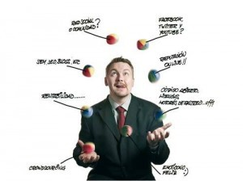

# 5 errores en la autogestión de redes sociales propias

Uno de los **mayores problemas de las PYMEs es que apenas tienen solvencia económica** e invierten todo su capital en montar la empresa, olvidando que, parte de su empresa, es la promoción de la misma. Teniendo en cuenta que ahora las cosas son mucho más fáciles de dar a conocer gracias a Internet, mucho emprendedores **se lanzan a la aventura de la autogestión de redes sociales.**

Es entonces cuando vienen los verdaderos problemas de la PYME ya que, un pequeño error de logística puede tener fácil solución pero un pequeño error de comunicación puede suponer una pérdida de credibilidad total para la marca.

Para que podáis al menos identificarlos, **os dejamos aquí los cinco errores que cometéis en la autogestión de las redes sociales.**

## Mentir al usuario

Un error que se comete a diario por parte de los empresarios que se autogestionan las redes sociales es que **se le miente al usuario**. Esto quiere decir que, por intentar vender, hacer quedar bien a su marca o no se sabe**, afirman cosas que no son ciertas.** Esto es lo primero que el consumidor tiene en cuenta a la hora de dejar una valoración en cualquier red social: que la marca sea sincera.

## Intentar vender a toda costa

Querer vender, vender, vender y vender más siempre **NO es una buena forma de autogestión de las redes sociales** y, esto, un profesional debería saberlo muy bien. Al igual que no se le amenaza al cliente físico de la tienda que compre a punta de pistola, en redes sociales publicar a todas horas que compren X artículo tiene el mismo efecto. **Las redes sociales SOLO contribuyen** a aumentar ventas pero, lo cierto, es que no son el lugar propicio para iniciar las ventas ya que no están preparados para ello los usuarios. Para que la gente compre a través de las redes sociales, su gestión tiene que ser perfecta y la venta hacerse de forma muy sutil.

## Copiar las estrategias

El mayor error que se comete en la autogestión de las redes sociales es que NO se traza una estrategia de comunicación clara. Está claro que cada uno es especialista en lo suyo y por eso no todos saben trazar una estrategia de comunicación. Esto lleva a que las PYME **empiecen a copiar estrategias o simplemente cosas que sí que les funciona a la competencia**. El problema es que la competencia es única y lo único que va a poder ver tu usuario es que tú estás copiando a tu **_enemigo_**. ¿Qué va a decirle esto? “Copio a este porque es mejor que yo”. Pierdes la venta.

## Darle coba a un Troll

NUNCA, de verdad, nunca hay que seguirle la corriente al **troll** [(pincha aquí si no sabes que es un troll)](<https://es.wikipedia.org/wiki/Trol_(Internet)>) Sabemos que es vuestra marca y la queréis igual o más que a un hijo. Por supuesto, ver un comentario así duele pero no es motivo suficiente como para acabar dándole coba al Troll ya que esto os dará una imagen de trolleables, por lo que a**cabaréis siendo diana de críticas sin sentido y os acabaréis agobiando.** Además de esto, el mayor problema de seguirle el juego al Troll es que al final acabáis dando mala imagen de vuestro negocio. **[Aprender a hacer frente a un troll en redes sociales](/blog/troll-en-redes-sociales) es esencial para afrontar la crisis general.**

## Abrir redes sociales sin sentido

No todos los usuarios de Internet son iguales ni las redes sociales tampoco. Un **error garrafal en la autogestión de redes sociales** es que, los empresarios, creen que su producto es bueno para todo el mundo, lo que acaba **convirtiéndose en un caos de redes sociales** así como de tonos en la comunicación. Hay marcas que se pueden gestionar mejor en unas redes sociales y otras que no. No todas sirven para una misma marca y, tampoco, una misma marca sirve para todas las redes sociales.

Si os habéis reconocido en **más de dos errores** en vuestra autogestión de redes sociales, es el momento de buscar asesoramiento profesional para **evitar que la imagen y la reputación de vuestra marca acabe por los suelos**.

## Otros posts sobre errores de redes sociales

### [Los 24 errores que no debes cometer en Marketing digital y social media](http://www.marketingandweb.es/marketing/peores-errores-marketing-digital/)

### [Los 14 errores a evitar al crear tu marca personal](http://claudioinacio.com/2015/02/17/errores-evitar-marca-personal/)

### [13 verdades que nadie te dijo al emprender un negocio](http://www.publicidadenlanube.es/emprender-un-negocio/)
