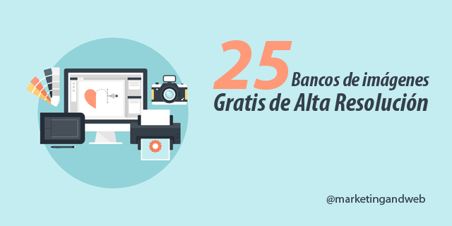
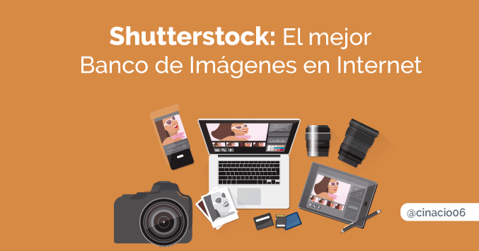

# Descubre los mejores Bancos de Imágenes Gratuitos
Aunque no lo parezca, **redactar el contenido es la parte más sencilla** a la hora de crear contenido único y exclusivo en vuestro blog ya que las complicaciones llegan cuando estamos buscando imágenes y/o recursos gráficos para incluirlos con nuestros textos.

Teniendo en cuenta que vivimos en una era completamente visual, es muy lógico que el usuario se fije antes en las imágenes que en los textos y más si estas están a la derecha. Los recursos gráficos que uses hablarán de tu profesionalidad y de exclusividad por eso es tan importante cuidarlas al máximo, siempre dentro de nuestras posibilidades.

Es muy normal que recurramos con mucha más frecuencia de la que queremos, a los buscadores de imágenes como Google, Yahoo y Bing, por ejemplo. Sin embargo muchos no saben los riesgos que esto supone y cómo puede verse esto para el usuario. Por eso, lo mejor que podemos hacer es **usar imágenes de los bancos de imágenes.**

## ¿Qué beneficios tienen los bancos de imágenes?
Desde hace unos años**, el blogging se ha puesto muy de moda** entre las empresas y los particulares. Esto se debe a que es lo que más contenido genera y por lo tanto es la mejor solución para empezar a trabajar el marketing de contenidos y mejorar así el SEO con las palabras clave. Por supuesto, **nuestros artículos, descripciones y productos tienen que ir siempre acompañados de una imagen**. Esto, en general se debe a que de un plumazo, con las imágenes los usuarios se pueden hacer una idea esencial y básica de lo que se va a trabajar en el artículo en cuestión.

El único problema es que son muy pocas las personas que se ponen a buscar imágenes de calidad para acompañar sus artículos y esto, aunque al principio no lo parezca, puede pasarnos factura.

Lo primero es que la mayoría de las imágenes de los buscadores, tienen muy poca calidad por lo que esto puede suponer que el usuario no disfrute de la experiencia como nosotros teníamos pensado. Además de esto, en general es bastante complicado encontrar imágenes específicas que concuerden con nuestro tema.

Otro de los problemas de las imágenes sacadas de internet es que la gran mayoría tienen derechos de autor y, por supuesto, esto los buscadores lo saben. Por eso, extraer las imágenes para la web y/o nuestro blog de los bancos de imágenes es la mejor opción.

Además de **encontrar las dimensiones que más nos interesan** para colocar las imágenes, estas vienen con una **buena calidad y resolución** que nos permite trabajar con ellas sin tener que correr el riesgo de que se pixelen o baje la calidad de la misma cuando las modificamos. Por otro lado, es muy interesante extraerlas de los bancos de imágenes ya que ahí l**os derechos de autor se ceden y no habrá problema** siempre y cuando se cite la fuente.

El único inconveniente de esto es que, en general, **los bancos de imágenes son de pago** y esto es lo que hace echarse para atrás a muchas empresas ya que deben contemplar esto en su presupuesto a la hora de invertir en contenido.

Para que todos podáis utilizar los bancos de imágenes, os dejamos a continuación **los bancos de imágenes gratuitos más conocidos.**

## Los 6 bancos de imágenes gratuitos más conocicos
### [**Unsplash**](http://https://unsplash.com/)

En unsplash podemos encontrar miles de imágenes para usarlas, como bien dice su eslogan, para lo que queramos. Sin embargo, **unsplash tiene un gran defecto: no tiene buscador**. Aún así sigue siendo uno de los mejores **bancos de imágenes gratuitos**, sin duda alguna.

### [**Startup Stock Photos**](http://startupstockphotos.com/)

Aquí se pueden encontrar imágenes de alta calidad y resolución con las que podremos hacer lo que nos apetezca, es decir: trabajarlas, modificarlas, colgarlas, etc. sin duda, es otro de los bancos de imágenes gratuitos que no puede faltar en el “**favoritos” de vuestro navegador**.

### [**Flickr**](http://flickr.com)

Este **banco de imágenes gratuito** es uno de los más conocidos y si hay algo que nos encanta de él es que es completamente gratuito y que está en castellano. Ojo, porque para que las búsquedas se hagan de la forma correcta, lo mejor es hacerlas con la opción de **“Buscar sólo dentro de contenido con licencia de Creative Commons”**.

### [**Free images**](http://http://www.freeimages.com/)

Esta web cuenta con unas **350.000** imágenes que podréis utilizar de forma completamente gratuita. Además, toda ella está organizada por categorías para que la búsqueda sea mucho mejor y sencilla.

### [**Public Domain Pictures**](http://http://www.publicdomainpictures.net/)

Otro de los **bancos de imágenes más valorados** ya que cuenta con una amplia gama de imágenes completamente gratis. El único problema es que hay que registrarse, aunque es completamente gratuito… ¡el spam sigue siendo su peor fallo!

### ¿Te ha sabido a poco es te post tal vez te interesen estos?

### [**25 Bancos de Imágenes Gratuitas de Alta Resolución y Calidad. Actualizado 2016**](http://www.marketingandweb.es/marketing/bancos-de-imagenes-gratis "banco de imágenes gratis") 

### [Aquí un post de claudio Inacio sobre Shutterstock](http://claudioinacio.com/2016/06/08/shutterstock-video-tutorial-completo/)

