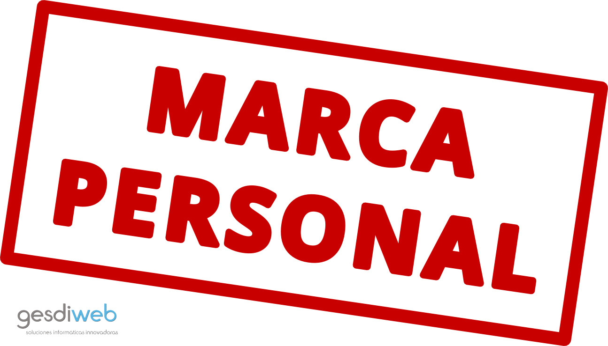

# Por qué merece tener un blog para relanzar tu marca personal
En el mundo de Internet solo existe una realidad: o comes o te comen. Con todo esto de la visibilidad aumentada, cada vez es más complicado captar clientes o, al menos, llamar la atención hacia nosotros. Está claro que, siendo autónomos y si no tenemos una tienda que podamos pasar a online, ¿para qué queremos tener una página web?

Esa pregunta nos la hemos hecho todos más de una vez en nuestra vida, pero lo cierto es que desde que el mundo de **Internet se usa para TODO**, es algo esencial. Al menos tener un pequeño hueco en este gran universo interactivo.

Seguramente muchos, os estéis planteando la idea de lanzar una web o un blog para poder daros a conocer. Sí, va a costar, pero vale la pena, sobre todo para hacer marca personal. Eso del boca a boca mola, pero ya se está pasando de moda. Ahora es mucho más fácil buscar en **Google cualquier término y encontrar al “mejor” profesional**. O al menos al que tiene mejor SEO.

Si vosotros queréis **darle un giro o relanzar vuestra marca personal**, aquí os dejamos algunas razones por las que vale la pena tener un blog para que os dé apoyo y soporte en la esfera online.

## 4 razones para tener un blog
### Aprende de todos
El **mundo blogger puede ser uno de los mejores entornos para seguir aprendiendo** y no solo de la teoría. El hecho de poder absorber el conocimiento de profesionales en activo, os dará muchas pistas de cómo está cambiando vuestro entorno profesional, así de cómo se debe actuar frente a él.

### Crea tu espacio propio
Una de las mejores cosas del **blog es que te permite crear varios espacios**, tanto públicos como privados. Lo mejor de tener un blog es que te permite escribir tanto a nivel personal como a nivel profesional. Puede ser utilizado como tú quieras y actualizado cuando tú quieras. ¿Lo mejor? ¡Tiene autoría propia! Esto,, permitirá que tus posibles clientes sepan quién eres y esto, por supuesto, ayudará a tu marca personal.

### Sigue la estrategia de marca personal
**El blog es la mejor herramienta para establecer cómo vas a seguir tu estrategia personal**. Crear un blog te ayudará a ofrecer contenido de calidad y demostrar así tus habilidades profesionales. Al fin y al cabo, ese es el cometido del blog ya que te ayudará a potenciar tu visibilidad en el mundo online. El **blog es la clave para que seas un candidato mejor valorado**.

### Reputación online
Crearse una reputación es complicado y más cuando es online. Ya no basta con exponer en qué se es bueno, sino **que hay que demostrarlo y una de las mejores habilidades para hacerlo es mediante el blog**. Como ya hemos dicho, permite dar un enfoque profesional y personal a la vez. Para ser bueno no solo hace falta serlo, si no demostrarlo.

Como ya sabéis, cada vez es más fácil googlear a la gente y rastrear sus pasos por internet**. Cread un blog y demostrad de la mejor forma de lo que sois capaces** y lo que valéis. Al final, lo único que importa es la marca personal: qué ofrecéis y cómo lo hacéis.
