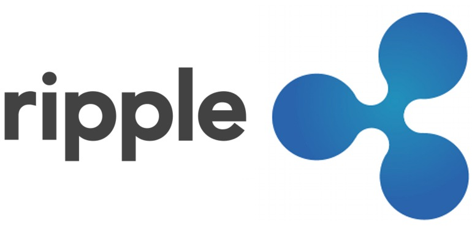
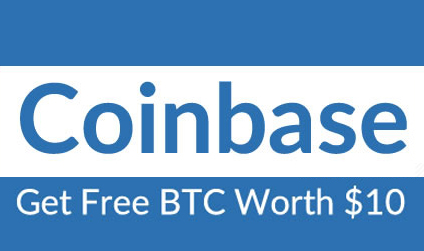
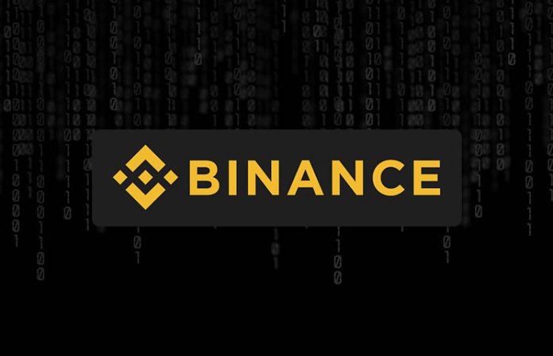

# Comprar Ripple y otras Criptomonedas en Binance

Aquí te dejo un video explicando como aprender a _**comprar en Binance tanto Ripple como cualquier Criptomoneda** enviando etherum desde coinbase_

## ¿Qué es Ripple?

Ripple (XRP) 1 es un proyecto gratuito, basado en el paradigma del socio, un software que busca el desarrollo de un sistema de crédito. Cada nodo Ripple funciona como un sistema de intercambio local, el sistema completo es un banco mutuo interconectado. En el extremo, la red Ripple es un servicio de red social basado en el honor y la confianza de las personas existentes en las redes sociales del mundo real. Por lo tanto, el capital financiero se basa en el capital social. La versión de red de acceso reducido sería una extensión del sistema de banco jerárquico existente. En ese caso, serían medios de pago alternativos que un banco central no atravesaría.

## Dónde Comprar Ripple

En su web oficial encontraras varias páginas que ellos recomiendan, personalmente yo compro en Binance.

Os voy a explicar la **forma más rápida de comprar ripple,** hacemos una cuenta en **Coinbase**, compramos ETH y con el ETH comprado nos lo enviamos a Binance que permite comprar Ripple negociando con etherum ( ETH). Evidentemente si tienes ya una wallet con etherum o Bitcoin puedes enviarlas a Binance para comprar con ellas.

Vamos a ir por pasos:

### 1 -Crear una Cuenta en Coinbase

Creáis una cuenta en [**Cuenta en Coinbase ( pulsa aquí)**](https://www.coinbase.com/join/595123bd24ec9004dcde2dd1)

Una vez tengas la cuenta la tendras que validar, enviando foto de tu dni, y validando tu teléfono y si posteriormente quieres sacar tu dinero una cuenta.

Pero bueno ya has creado tu cuenta y estas esperando a que la validen, mientras no la validen no podrás comprar, te recomiendo método tarjeta para que valides rápidamente

Una vez validada has de comprar por ejemplo 100 euros o dolares en ETH ( etherum) o BTC( bitcoin) , te recomiendo etherum ya que rápidamente tendrás el etherum en tu wallet y lo podras enviar a la Wallet de Binance para comprar ripple.

### 2- Crear cuenta en Binance

Si no tienes [**cuenta en Binance (pulsa aquí)**](https://www.binance.com/?ref=15701502) Lo más rápido para negociar en Binance es validar únicamente el mail y tu teléfono ( con este paso podrás mover BTC al día) y ahora ya transfieras a tu wallet ETH desde Coinbase o cualquier otra Wallet

### 3- Comprar Ripple desde Binance
Una vez tengas en tu wallet el saldo en ETH podrás comprar rápidamente, os dejo un pequeño video por si no os aclaráis pero las dos plataformas son bastante intuitivas

Espero que os sirva de utilidad si tenéis alguna duda no dudéis en realizar un comentario
