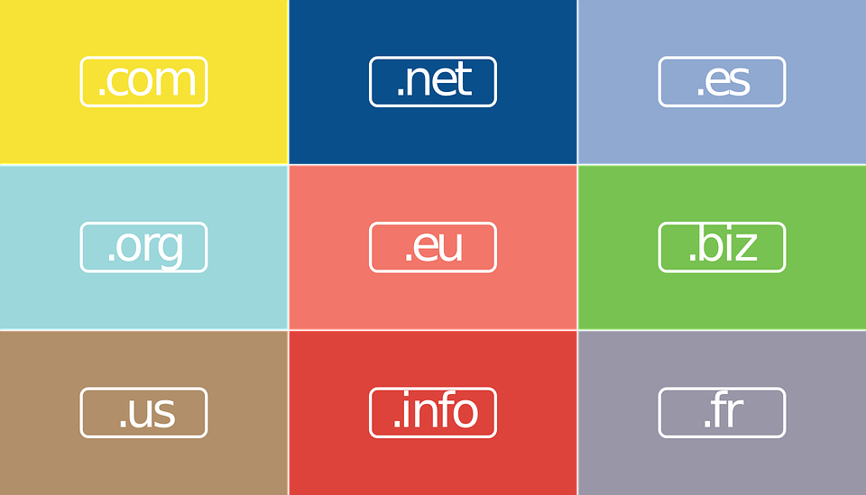

# Como Comprar un Dominio Web

Comprar un dominio para tu sitio Web es una de las tareas más difíciles de realizar correctamente, normalmente lo primero que hacemos a la hora de crear un sitio Web es comprar el dominio sin ni siquiera haber pensado bien de que vamos a hacer el sitio Web.

Es fácil cometer errores cuando compras un dominio, a mí me ha pasado cientos de veces, se me ocurre lo que creo yo que es un buen nombre de dominio para mi sitio Web y rápidamente lo compro, no vaya a ser que me lo quiten. El problema llega al día siguiente cuando ya no me parece tan buen nombre de dominio y al final ese dominio no lo uso para nada porque realmente no me gusta.

En este artículo vamos a darte una serie de **consejos que te ayudarán a comprar un dominio** que se adapte a las necesidades de tu Web minimizando los riesgos de que te arrepientas de su compra, hablaremos sobre que extensión escoger, sobre whois privacy y sobre la propagación DNS, vamos a ello.

## 1\. No te apresures

Anteriormente te he comentado lo que me pasa con la mayoría de dominios que compro, que finalmente no los acabo utilizando porque el día siguiente ya no me gustan tanto.

Las páginas de registro de dominio hacen algo similar a Booking intentan conseguir la compra lo más rápido posible, porque saben que si te lo piensas posiblemente no realices la compra del dominio, pero claro los dominios no son como un hotel, **una vez comprado te lo comes un año** o el tiempo elegido, no hay más.

Mi recomendación es que si tienes pensando comprar un dominio **te lo apuntes y medites sobre qué vas a hacer con él** y si realmente es el mejor nombre de dominio que puedes escoger, el tiempo de meditación debería de ser alrededor de una semana.

No te preocupes, realmente es muy extraño que nos quiten un nombre de dominio salvo que sea algo muy concreto y con mucha demanda.

## 2\. Extensión a escoger

En la actualidad existen más de 100 extensiones de dominios, podríamos decir que hay una para cada cosa. Básicamente, de cara al posicionamiento Google las distingue en 3 grupos:

- **Genéricas:** Extensiones que no se orientan a ningún país, posicionan por igual en todos los países. Las más comunes son .com, .net, .info, .org y la mayoría de las nuevas extensiones.
- **Locales:** Extensiones orientadas a un país en concreto, se dice que posicionan mejor en el país al que apuntan a costa de posicionar algo, pero en otros países a los que no va orientada. Por ejemplo, tenemos .es (España), .cat (Cataluña), .ar (Argentina).
- **Especiales:** Orientadas a organismos públicos y que no pueden ser registradas por particulares. Por ejemplo, .gob (Gobiernos), .edu (Educación), etc…

Por lo general siempre utilizaremos una extensión genérica salvo que seamos una empresa que únicamente realiza su actividad en un país en concreto. Todas las extensiones genéricas posicionan por igual, pero es mejor siempre que sea posible elegir la .com ya que si el usuario olvida la extensión de tu web la primera que probará será la .com.

Si te has decidido por una extensión local tienes que tener en cuenta que esa extensión no está gestionada directamente por la ICANN. ¿Qué significa esto? Que cada gobierno pone las reglas de su dominio, por ejemplo, en la .cat tienes que tener una cierta cantidad de textos en catalán, mientras que la .es puede ser expropiada si una empresa demuestra que utiliza su marca, ya ha habido casos de estos. Infórmate bien antes de comprar cualquier extensión de sus reglas y demás.

## 3\. El precio del dominio

Por lo general, a la hora de comprar un dominio no nos debemos guiar por el precio, realmente la diferencia entre una y otra empresa varia alrededor de 5€ y normalmente con la diferencia de precio hay diferentes servicios que ofrece.

Normalmente las empresas americanas venden dominios Web más baratos que las empresas españolas, pero claro eso tiene un hándicap y es que normalmente el soporte o no habla español o bien baja mucho su calidad.

Si no tienes mucha experiencia en comprar dominios Web te recomendaría escoger una empresa que te vaya a ayudar con todas las dudas que tengas, sobre todo si no sabes ni siquiera lo que es una DNS.

En Confrontador [p**odéis comparar precios de dominios**](https://confrontador.com/comprar-dominio-web/)

## 4\. El hosting

La duda más frecuente atendida es “He comprado un dominio, pero no sé cómo subir archivos”, claro lo que te ha pasado es que has comprado el dominio, pero no te has informado correctamente.

El dominio necesita un hosting y un hosting necesita un dominio Web, para que funcione necesitas tener aparte del dominio alojamiento.

Si vas a comprar alojamiento probablemente no necesites comprar un dominio ya que normalmente si contratas por un año el hosting te regalan el dominio.

Si ya tienes un hosting puedes comprar el dominio y apuntarlo introduciendo las DNS del hosting en el dominio.

En caso de que no tengas mucha experiencia en dominios y hosting **es recomendable comprarlo todo en el mismo sitio**, así ya lo tendrás todo configurado y no deberás tocar gran cosa para tener tu sitio Web online.

## 5\. Whois Privacy

Por último, me gustaría hacerte una recomendación. Si tienes la posibilidad de contratar el Whois Privacy no lo dudes, normalmente cuesta 5€ más al año, pero te ahora un gran quebradero de cabeza.

Si no tienes activado el servicio Whois Privacy cualquiera puede consultar los datos del registrador del dominio (Nombre, Apellidos, Teléfono, E-Mail, Dirección, etc), en principio esto no sería ningún problema si no fuese porque hay mafias que se dedican a robar los datos del Whois para venderlos a empresas.

La consecuencia de esto es que puedes recibir una gran cantidad de Spam en tu correo, llamadas publicitarias y en el peor de los casos puedes recibir estafas.

Una estafa muy común es llamar al propietario del dominio haciéndose pasar por la empresa registradora del dominio y decirle que han detectado malware en su servidor y necesitan que les des el usuario y la contraseña para realizar la desinfección. **Tu proveedor nunca te va a pedir la contraseña al completo**, no caigas en trampas de este tipo, desconfía de cualquier persona que pida datos de tus Webs.

## 6\. Propagación DNS

Por último, me gustaría recordarte que cuando compras un dominio las DNS tienen un tiempo de propagación de entre 1 y 48 horas, dependiendo de la extensión.

Las genéricas normalmente actualizan las DNS a las pocas horas e incluso en minutos podemos tener nuestro dominio funcionando con nuestro hosting, sin embargo, extensiones locales como por ejemplo la española pueden tardar hasta 24 horas en actualizarse… Ya sabes, en España todo funciona diferente.

Mientras que las DNS no se hayan propagado no puedes acceder a tu web, ni conectarte mediante FTP y tampoco utilizar los correos electrónicos. En Google puedes encontrar varios servicios que monitorizan la propagación de las DNS e incluso te avisan una vez que se haya realizado para que comiences a trabajar en tu sitio Web.

Ten presente este punto porque otras de las dudas más comunes son he pagado el dominio y el hosting y mi Web no funciona, es que no se han propagado las DNS.
