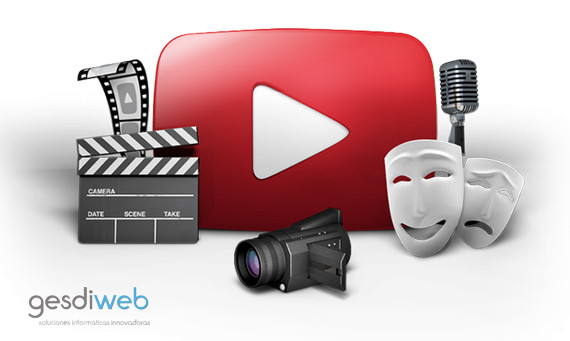
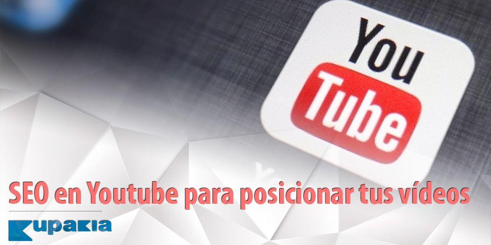

# Crea a la perfección tu canal de Youtube
Hay muchas empresas que no tienen en cuenta Youtube en su estrategia de redes sociales ya que es una de las más complicadas y más exigentes. **En Youtube no todo vale** y, además, no solo es cuestión de hacer actualizaciones relativamente sencillas.

Sin embargo, aún siendo una de las redes sociales más complicadas, es cierto que puede ser una de las más beneficiosas para cualquier empresa que busque **[aumentar las visitas a su web o blog](https://www.gesdiweb.es/aumentar-visitas-blog/)** y, por lo tanto, **aumentar las ventas**. Pero, aún así, los visitantes de Youtube son bastante exigentes a la hora de seguir un canal u otro, por eso es esencial que sepas qué es lo que tienes que hacer si te estás planteando seriamente abrirte un canal de Youtube.

## Los 6 pasos básicos para crear tu canal de Youtube
### El nombre del canal de Youtube
Es bastante obvio que lo primero que nos tenemos que plantear es cómo vamos a llamar nuestro canal. Si lo que quieres es posicionarte como marca personal o una empresa, usar tu nombre comercial puede ser lo mejor. Recuerda que, en Youtube, también te posicionas, por lo que es mucho **mejor usar tu nombre comercial** así como palabras clave que te definan.

### El avatar
El avatar es como el segundo nombre de tu canal de Youtube. Lo cierto es que los usuarios, se van a fijar antes en la imagen de tu canal que en el propio nombre, por eso, es muy importante que busques una imagen que te defina realmente. Las imágenes, además de para llamar la atención, se deben usar para crear recuerdo de marca. **Usar algo distintivo de tu marca** puede ayudarte tanto con los seguidores como con Google a la hora de posicionar.

### La imagen de portada
Aunque parece absurdo, sin foto de portada el canal de Youtube puede parecer un poco vacío y descuidado. Sí, como en cualquier otra red social. Por ello, nosotros te recomendamos que este sea tu tercer paso básico a la hora de crear tu canal de Youtube. Recuerda que, siempre, una imagen vale más que mil palabras por lo que es importante que, al igual que el avatar, **tu imagen de portada sea llamativa y distintiva.**

### Incorpora tus cuentas sociales
Sí, una de las mejores formas de demostrar que eres una marca activa y que no estás en Youtube por estar –cosa que suelen pensar los usuarios con más frecuencia de lo que nos gustaría-, es añadiendo el resto de tus redes sociales. Pero ojo, colócalo solo como información, no como una nueva alta de tus perfiles.

De este modo, les estás dando a tus usuarios la opción de **seguirte en el resto de tus redes sociales** que, a lo mejor, puede que sean más activas que tu canal de Youtube (con contenido más diario).

### La descripción
Como ya hemos dicho, darle la mayor información posible a Google a través de Youtube es esencial si lo que queremos es posicionarnos. La descripción es lo que mejor nos va a venir para este propósito a la hora de crear un canal de Youtube. **Usar palabras clave relacionadas con tu sector**, así como tu nombre comercial –el que está presente en el resto de redes sociales- te vendrá muy bien tanto para informar a tus posibles seguidores como a Google.

### Añade un tráiler a tu canal
Parece absurdo, pero tener un vídeo destacado a modo de presentación es algo que hace que los usuarios confíen más en una u otra cuenta. El hecho de tener una presentación más visual y dinámica te dará muchos puntos a la hora de tener un **canal llamativo, atractivo y de interés** para la mayoría de la comunidad youtuber.

Recuerda que, si en algún momento te sientes estancado o abrumado, siempre puedes contar con **el apoyo y la ayuda de un profesional**

## Otros post sobre youtube que te pueden interesar

