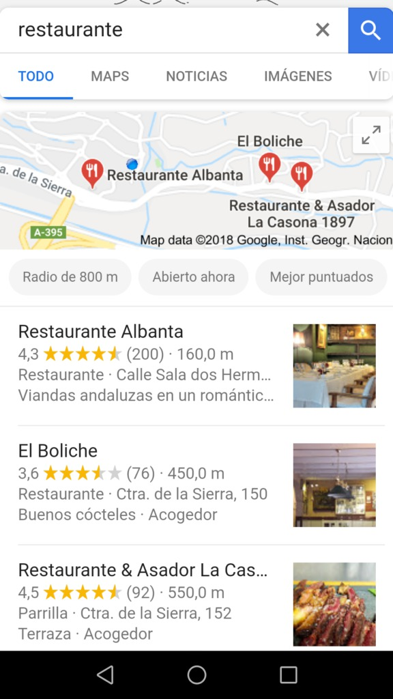

Uno de los segmentos más competidos en la búsqueda orgánica es el SEO Local. Es uno de los más competitivos porque también engloba una gran oportunidad de ganar clientes. El [Posicionamiento SEO Local](https://www.codigonexo.com/blog/captacion-de-trafico/seo/posicionamiento-seo-local/) es indispensable para captar clientes potenciales que realicen búsquedas en una zona geográfica determinada. En este artículo te ofrecemos algunos consejos que puedes seguir para conseguir ser de los primeros en los resultados de búsquedas locales.

Lo ideal para esta situación es contar con un negocio físico localizado en una zona geográfica, y una web que sirva de información y/o venta. De esta forma, las personas que busquen el producto o servicio que se tiene disponible en la página web, sabrán que el establecimiento se encuentra cerca de donde están ellos. Y para que este público pueda visualizar el espacio online, es necesario realizar un posicionamiento web efectivo.

## El móvil en el SEO Local

El uso de dispositivos móviles ha aumentado radicalmente en los últimos años, sobre todo en la utilización de buscadores. Es por ello que Google en el año 2014 permitió que los empresarios que tenían un negocio local, tuvieran más visibilidad. Estas estrategias suelen centrarse en el buscador más utilizado: Google. Supera el 90% de las búsquedas en Internet.

_**Más de un tercio de las búsquedas de móviles se realizan a nivel local**_

Piensa en un momento cuando quieres obtener información sobre algo… ¿dónde sueles buscarla? Internet se ha convertido en la mayor fuente de consultas de hoy en día, por ello si una persona está buscando información sobre el servicio y/o producto que ofreces en tu negocio, puede ser una gran oportunidad de venta el que tu información le sea ofrecida.

La optimización de los contenidos no solo debe estar enfocada al SEO Local, sino a uno más general. Las dos estrategias son totalmente compatibles. Además de poder compenetrarse entre sí, es necesario poder adecuar la página web para este motor de búsqueda y conseguir así más clientes.

## Nociones básicas del SEO Local

Competir por una posición elevada es difícil, pero no imposible. Antes de dedicar tiempo al contenido de la web, es necesario seguir las siguientes recomendaciones. Estas son fundamentales para que los esfuerzos sobre el contenido tengan su fruto:

- Asegúrate de que los nombres, direcciones y números de teléfono de los directorios locales son los correctos. Si no apareces en los resultados de búsqueda, tus posibles clientes no podrán encontrarte fácilmente.
- Crea tu perfil en Google My Business y Bing Places For Business. Utiliza para ello palabras clave relacionadas con el servicio o producto que vendas. Deberás exponer toda la información relevante sobre tu empresa, lo más completa posible. Esto es tanto para el usuario como para Google.
- Mejora las calificaciones sobre tu negocio para completar de la mejor forma posible el perfil en Google My Business.
- Producir contenido local, el cual explicamos en el siguiente apartado.

## Contenido SEO Local

Existen dos pasos muy importantes a la hora de crear contenido para el SEO Local de cualquier establecimiento y su posicionamiento web, y son los siguientes:

1.  Haz que tu página web sea RESPONSIVE, es decir, que sea compatible en cualquier dispositivo. El objetivo es que sea visible en móviles, que es donde se concentran más búsquedas.
2.  Utiliza un ESQUEMA DE MARCADO. Con estas etiquetas html, Google sabrá mejor cómo está estructurada la web, pues el objetivo es facilitarle la tarea.

Crear el contenido para el SEO Local tiene el mismo objetivo que el contenido que normalmente se produce para posicionarse de forma general. En este caso, se deben utilizar las palabras clave locales. Pongamos un ejemplo:

Alguien que se encuentra en Granada, decide buscar un restaurante para comer. Generalmente, lo primero que hará será consultar Google para saber qué opciones tiene:

Estos son los primeros resultados al poner la palabra “restaurante” en Google en un teléfono móvil. ¿Y por qué aparecen unos restaurantes y otros no?¿Con qué zona geográfica se relaciona este resultado? Google, por lo general, utiliza la localización del dispositivo con el que se realiza la búsqueda para enseñar empresas locales que puedan interesar. Los restaurantes que aparecen en las primeras posiciones son los que mejor están posicionados para el SEO local de esa ciudad. En este ejemplo, el dispositivo se localizaba en la ciudad de Granada.

El SEO Local será importante para negocios de este tipo, donde el público objetivo se encuentra en una zona geográfica determinada. En el caso de que la empresa tenga varias localizaciones, será necesario estudiar cómo optimizar la web para cada una de estas posiciones.

Si el público objetivo se encuentra en una zona geográfica específica, será necesario estudiar y obtener datos de su perfil. Un ejemplo de lo que podría hacerse sería realizar entrevistas cara a cara por la zona de personas que puedan estar interesadas en tu negocio, u ofrecer una pequeña encuesta a los clientes que recibas. Toda la información obtenida de clientes locales ayudará a cualquier negocio a optimizar su página web para una localización en concreto.  

Herramientas como Audience Insights de Facebook, que permite conocer más datos sobre los seguidores del perfil de empresa en esta red social, o Keyword Planner de Google, con el que se puede medir el volúmen de búsquedas de las palabras clave seleccionadas gracias al estudio del público objetivo.

## Algo más que crear contenido de SEO Local

Posicionarse en los buscadores utilizando contenido es importante, pero no es lo único que debe tenerse en cuenta. Además de las tareas de SEO esenciales para posicionar contenido, es necesario realizar un estudio completo de la situación y plantear la mejor estrategia a seguir para establecer una conexión local con los clientes. Es decir, interactuar y participar activamente en la comunidad puede ayudar a dar a conocer el negocio entre sus vecinos.

¿Cuál es la mejor publicidad para un negocio? La recomendación, el boca a boca de los clientes. La satisfacción en este sentido es importante, complacer a los consumidores y convertirse en su primera opción cuando piensen en un problema o situación que nuestro negocio pueda resolver con servicios y/o productos.

Más allá de crear contenido optimizado, es necesario centrarse en estrategias orientadas a lo local. Por ejemplo, alguna temáticas que pueden servir para esto son:

- Alojamiento de eventos locales
- Patrocinar eventos de la localidad
- Publicar como invitados en blogs ajenos locales
- Asistir a eventos cercanos y relacionados con el negocio
- Realizar o visitar conferencias de diferentes organismos relevantes

Son aspectos que pueden adaptarse a cualquier tipo de negocio. Infórmate sobre la industria a la que pertenece tu empresa en la localidad donde se encuentr. Puedes encontrar muchas oportunidades que harán que más personas sepan de tu existencia.

La idea fundamental es posicionar el negocio como una marca líder de la comunidad local. Por esta razón, la implicación social y comunitaria es imprescindible. Una sección de noticias locales puede ser una gran idea para ello, y comunicarlas a través de los diferentes perfiles locales.

Para cualquier estrategia que vayas a crear para tu SEO local, te recomendamos que siempre se cree un plan de acción. Planificar, controlar y analizar son los pasos indispensables si quieres que tus esfuerzos tengan resultados excelentes. Establece los objetivos que quieres conseguir, cómo vas a hacerlo y qué harás cuando los alcances.
