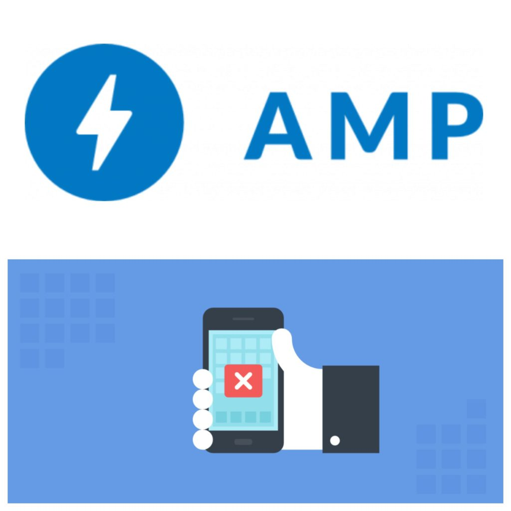
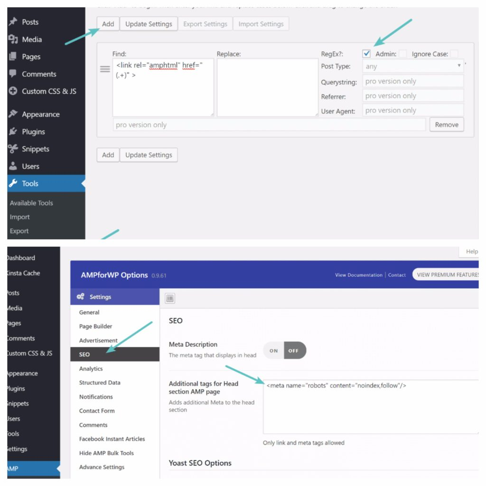
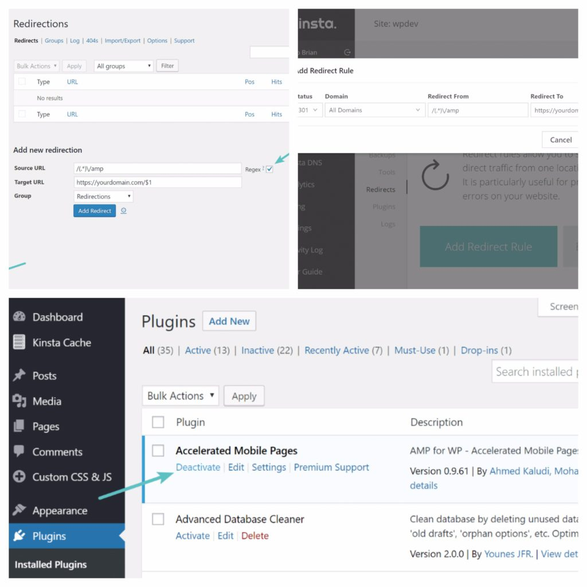

# ¿Qué hacer para deshabilitar tu wordpress para AMP?

Si llevas un sitio de WordPress probablemente ya has contemplado en algún momento si debes o no implementar el nuevo Google AMP para móviles. Os dejo con los compañeros de [PrositiosWeb](http://www.prositiosweb.com/) que terminaron probándolo por un tiempo en una de sus webs de pruebas.

Al final, no vieron buenos resultados y terminaron por perjudicar su tasa de conversión en dispositivos móviles. Así que hoy vamos a indagar en la forma de desactivar Google AMP en tu blog, y cómo hacerlo sin el peligro de errores 404 o dañar tu SEO.

## Como desactivar AMP en WordPress

**Simplemente desactivar** el complemento de AMP no es la solución, **podría terminar dañando realmente tu sitio**, así que ten cuidado. La buena noticia es que los dos métodos mencionados a continuación no requieren un desarrollador de WordPress y se puede hacer en pocos minutos.

## 

### Que és y cuándo apareció AMP

**Google AMP** (Accelerated Mobile Pages Project) apareció por primera en octubre de 2015. El proyecto se basa en AMP HTML, un nuevo standard que permite crear páginas web de muy poco peso. Para decirlo simplemente, ofrece una manera de servir una **versión simplificada** de tu web.  **¿Por qué Google AMP no funcionó para nosotros?** Debido a todo el bombo en torno a Google AMP, decidimos probarlo en una de nuestras webs de pruebas. Nunca se sabe qué pasará hasta que se pruebe algo. Así que lo dejamos funcionar durante dos meses y aquí están las conclusiones a las que llegamos.  

_**Nota:** Esto podría variar en casi todas las industrias, por lo que recomendamos probarlo en tu propio sitio antes de sacar conclusiones_. Un par de maneras de probar esto incluyen:

·         Visualización de datos en Google Search Console antes y después.

·         Comparación de datos de Google Analytics en sus URL’s de AMP vs URLs originales de tráfico orgánico antes y después.

La parte más importante fue ver los datos de Google Analytics para el periodo en que se habilitó AMP:

- Nuestros dispositivos móviles cayeron un 59,09%.
- Nuestras suscripciones al boletín de noticias por correo electrónico desde móviles se redujo en un 16,67%.
- Las creaciones de cuentas desde dispositivos móviles cayeron un 10,53%.

Debido a esto, decidimos que _**Google AMP no funcionaba para nuestro modelo de negocio**_. Entonces, ¿_por qué no vimos buenos resultados, cuando otros lo hacen_? Bueno, probablemente una de las mayores razones es que nuestro sitio ya funciona bastante rápido en el móvil. Así que no vimos un gran aumento en la velocidad, como algunos otros sitios con mucha publicidad podrían llegar a tener.

Según Google, el 70% de las conexiones de redes móviles a nivel mundial se producirá a velocidades 3G o más lentas hasta 2020. Así que si bien es muy importante optimizar para móviles, los que ya **tienen un sitio bien optimizado probablemente no notarán grandes diferencias.**

Otra razón es que no publicamos noticias. Muchas publicaciones grandes están usando AMP y aprovechando el carrusel en SERPs. Un montón de grandes empresas como **The Washington Post, Gizmodo y Wired** vieron grandes mejoras con Google AMP, pero estos son sitios orientados a las noticias y sitios con mucho anuncio. Nosotros, por supuesto, publicamos mucho contenido, pero nuestro enfoque principal sigue siendo generar leads y conseguir clientes.

¿Podríamos haber optimizado más la tasa de conversión a nuestra instalación de AMP? Probablemente sí. Hay maneras de agregar ahora CTAs, inscripciones de boletín de noticias, etc. Pero después de ver los datos de conversión no valía la pena administrar Google AMP por separado, lo que puede ser un dolor, sólo para tener un sitio ligeramente más rápido para móviles. Además, hay que ver si gran parte del tráfico que llega a tu blog o web procede de dispositivos móviles. Si este no es tu caso, y ya has instalado el AMP, quizás la opción más interesante sea **desactivar Google AMP**.

## Formas deshabilitar Google AMP

Hay un par de maneras diferentes de desactivar Google AMP. Google tiene su documentación oficial sobre cómo eliminar AMP de la Búsqueda de Google. Un gran problema con esto es que normalmente requiere un desarrollador y sus instrucciones no son muy amigables para WordPress. Su primer paso es **eliminar el enlace rel = “amphtml”** de la página canónica no AMP, mientras que todavía deja la página AMP en su lugar. Afortunadamente, aunque hay algunas maneras diferentes de abordar esto sin dañar su SEO. **No tiene que desactivar simplemente el complemento de Google AMP, ya que resultará en 404 páginas**.

### 

**Opción 1 – Buscar y reemplazar (Regex)**

La primera opción consiste en utilizar un complemento de búsqueda y sustitución para eliminar el código rel = “amphtml” mientras no se indexan las páginas de AMP. Suponemos que estás utilizandos el plugin gratuito de **AMP para WordPress**.

#### Paso 1

Primero, necesitarás descargar e instalar el complemento gratuito de WordPress **Real-Time Find and Replace**. Una de las grandes cosas sobre este plugin es que no modifica tu base de datos o sitio, por lo que es muy seguro para usar en tu sitio sin preocuparse de romper nada. Básicamente, encuentra y reemplaza las reglas que se ejecutan DESPUÉS de que una página es generada por WordPress, pero ANTES de que se envíe al navegador del usuario. Si eres un desarrollador, podrías, por supuesto, hacer una búsqueda normal y reemplazar. Normalmente, recomendamos realizar cambios en la base de datos a largo plazo, pero en este escenario, funciona muy bien para eliminar temporalmente el código AMP mientras las cosas se vuelven a indexar. También significa que puedes hacerlo fácilmente sin un desarrollador. Aunque siempre recomendamos seguir haciendo una copia de seguridad! El plugin ya ha sido descargado y usado más de 20.000 instalaciones activas con un 4.5 de 5 estrellas. ·

####  Paso 2

Haz clic en Buscar y reemplazar en tiempo real en las herramientas de su panel de WordPress. Haz clic en “Agregar” y agregue el siguiente código en el campo Buscar:  Haz clic en la casilla junto a “RegEx” y, a continuación, haga clic en “Actualizar configuración”. Esto reemplazará o quitará esa importante etiqueta de AMP que recomienda Google en sus páginas y/o posts canónicos que no son de AMP.  ·

####  Paso 3

 El siguiente paso es **marcar las páginas de AMP como no-index**. Haz clic en el panel de opciones de AMP para WP y en la sección “SEO”. En la sección Etiquetas adicionales para la cabeza, ingrese el siguiente código y pulse “Guardar cambios”.   Esto le indicará a Google que ya no indexe tus páginas de AMP en la búsqueda y por lo tanto comenzará a volver a indexar sus URLs originales para móviles. Recomendamos dejar el plugin AMP habilitado hasta que todas las publicaciones o páginas de AMP se hayan re-indexado a las URL originales.  ·

#### Paso 4

También recomendamos seguir los redireccionamientos 301 en la **opción 2** abajo sólo para estar seguro!

### Opción 2: deshabilitar y agregar redireccionamientos

La segunda opción es un poco más desordenada, pero también hemos visto que funciona bien. Recomendamos esta opción sólo si tiene algún problema implementando el  método anterior. Esto implica simplemente desactivar el complemento AMP y **agregar redireccionamientos 301.**

#### Paso 1

El primer paso es simplemente **agregar redirecciones 301** para todo lo que tiene una dirección URL de AMP. En primer lugar, tendrá que descargar e instalar el complemento de redirección gratuito de WordPress. Podrías usar tu propia solución de redireccionamiento o complemento, pero la razón por la que recomendamos esto es porque necesitarás una que soporte expresiones regulares. Siempre puede desinstalar el complemento después de que todo se haya re-indexado.El complemento tiene actualmente más de 800.000 instalaciones activas con un 4 de 5 estrellas. Puede descargarlo desde el repositorio de WordPress o buscarlo en el panel de WordPress en los complementos “Agregar nuevo”.·

#### Paso 2

Haz clic en “Redirection” en las herramientas de tu panel de WordPress. A continuación, agrega el siguiente código al campo “Source URL” y asegúrate de marcar la casilla “Regex”:  /(.\*)\\/amp  A continuación, agrega lo siguiente al campo “Target URL” (actualizando el dominio con el tuyo propio):  https://yourdomain.com/$1  Asegúrate de que “Redirections” está seleccionado y haz clic en “Add Redirect”.  
Después de agregar esto, recomendamos navegar a un par de sus publicaciones o páginas de blog de AMP y probar para asegurarse de que se están redireccionando correctamente.

Alternativamente, si estás funcionando con Apache, podrías añadir lo siguiente a la parte superior de tu archivo .htaccess:

_\# Redirección de AMP a NO-AMP_

**RewriteEngine** ON

**RewriteCond** %{REQUEST_URI} (.+)/amp(.\*)$

**RewriteRule** ^ %1/ \[R=301,L\]

**Paso 3 Ahora ya puedes desactivar el Plugin AMP**

Entonces puedes desactivar el plugin de AMP para WordPress.

Asegúrate de revisar nuestros consejos adicionales más abajo para supervisar el proceso de re-indexación.

## Seguimiento de la re-indización

Puedes supervisar el progreso de la eliminación de Google AMP en Google Search Console en “_Aspecto de búsqueda> Páginas móviles aceleradas_“. Como se puede ver a continuación, en el momento en que implementamos la estrategia anterior, nuestras URL de AMP comenzaron a desindexarse. También puedes intentar volver a enviar tu archivo de mapa de sitio para acelerar el proceso. Dependiendo del número de páginas AMP que hayas indexado, este proceso puede tardar de un par de días a un par de semanas.

También recomendamos utilizar una herramienta de seguimiento de palabras clave. Por ejemplo, supervisamos nuestras palabras clave de escritorio y móviles usando [**Accuranker**](https://app.accuranker.com/). Nos permitió ver fácilmente el historial de cada palabra clave y que las urls amp en el móvil se estaban re-indexando a la URL original. Esto puede ser una manera rápida y fácil de verificar que todo salga bien.

## Conclusión eliminación AMP en WordPress

 A todos nos encantan los sitios para móviles más rápidos, y aplaudimos a Google por intentar hacer de la web un lugar mejor. Pero como hemos comentado anteriormente, tal vez no estés viendo los resultados que esperabas al hacer que tu web cumpliese con los estándares de Google AMP.  En cualquier caso, siempre recomendamos probarlo, ya que podría variar según tu nicho o industria. La cantidad de tráfico móvil que obtiene tu sitio también podría afectar enormemente a tus resultados. Afortunadamente hay formas sencillas de desactivar Google AMP si quieres recurrir a tu configuración original. Ambas opciones anteriores no requieren un desarrollador y se asegurará de que tus visitantes no ven el desagradable error 404, manteniendo tu clasificación en SERPs.
