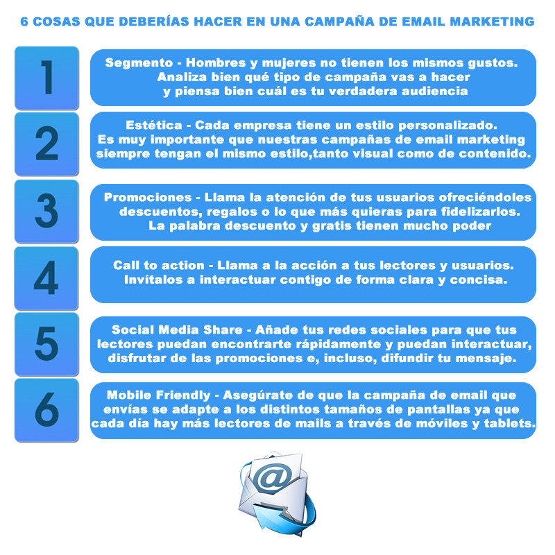

# Sácale mayor partido a tu email marketing
El **email marketing** es una nueva forma de comunicación con el usuario a través del mailing. Sí, seguro que todos habéis oído hablar de ello y es que es muy normal encontrarse más de un email promocional –es decir que proviene de una marca- en nuestro buzón de entrada.

Cada vez que ingresamos nuestro email en una página web estamos aceptando, en la mayoría de los casos, a que dicha marca nos envía un email promocional. Esto es, básicamente, lo que hacen a día de hoy todas las empresas para recordarles a sus clientes que están ahí. El **email marketing** llegó para quedarse ya que es una de las formas de comunicación más usadas y la más efectiva: **el 68% de los usuarios acaba accediendo a la web a través del email que han recibido**.

Es por lo tanto, una forma de comunicación y de venta para la empresa y, para el cliente, una forma de estar al tanto de todo lo que hace la marca ya sea en cuanto a promociones, descuentos, eventos, etc. Sin embargo, el **email marketing** tiene que cumplir una serie de requisitos ya que a día de hoy, los servidores de correo suelen detectar qué empresas usan el email marketing para spamear a sus seguidores. Es por eso, que toda **campaña de email marketing** tiene que estar orquestada y tener unos objetivos fijos.

Además de esto, cada uno de los emails que enviemos a nuestros usuarios debe **seguir una serie de pautas**. No es solo para evitar entrar de forma directa a la **bandeja de spam** –que también- sino más bien para mantener una línea de comunicación estable, asumiendo los propios requisitos del medio con el que estamos trabajando.

## Lo que todo email marketing necesita
## 
