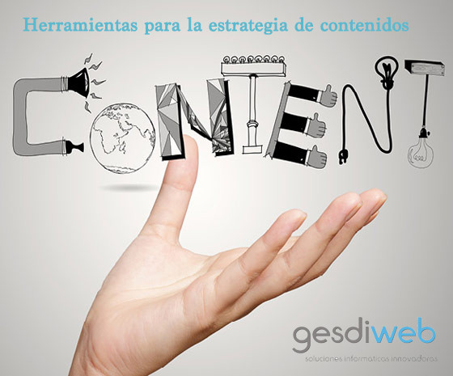

# Las mejores herramientas para la estrategia de contenidos de tu vida
La **estrategia de contenidos** es esencial para que tu marketing online funcione y obtengas los resultados que buscas, tanto económicos como de marketing. Tu contenido puede ser tu propio éxito o tu peor pesadilla si no sabes cómo usarlo en tu propio beneficio.

Jay Baer, lo explicó de la mejor manera “El contenido es fuego, las redes sociales solo la gasolina”. Tener una estrategia de redes sociales es esencial, asó como saber qué tipo de [redes sociales son las mejores para tu negocio](https://www.gesdiweb.es/redes-sociales-pymes/). Sin embargo, es **primordial tener claro que el contenido es la base de cualquier estrategia de Marketing Online** y por eso es muy importante trabajarlo a nivel corporativo.

**El contenido es lo que realmente comunica con tus seguidore**s y potenciales clientes y por ello es necesario que lo sepas usar en tu propio beneficio. Debes siempre combinar tu estrategia de redes con la de contenido para poder aumenatr tu alcance y seguir destacando entre todo el ruido que hay a día de hoy en los buscadores. Ser creativo, ingenioso con todo lo relacionado **con tu contenido es lo que te salvará de no perderte entre los millones de resultados.**

Ya no solo vale con crear buen contenido, sino que además, ese contenido tiene que publicarse en el momento y delante de las personas adecuadas. Para que esto no sea tan complicado como tú crees, te dejamos con algunas herramientas que pueden ayudarte mucho con esto.

## 4 herramientas para la estrategia de contenidos de tu empresa
### [BuzzSumo](http://buzzsumo.com/)
Ya os hemos hablado de esta herramienta en alguna otra ocasión, pero BuzzSumo es una muy buena herramienta para la estrategia de contenidos que debes seguir. Es una herramienta que usan muchos profesionales del sector para las **campañas de SEO**, sobre todo, aunque también es genial para las redes sociales así como para el blog.

Esta herramienta te permite ver qué se comparte de un solo vistazo. Con esto, lo que puedes conseguir es saber qué es lo que más se destaca en ese momento, qué es lo que más interesa y, por supuesto, qué es lo que mejor resultado está dando a los profesionales del mundo del Marketing Online**. Lo mejor es que puedes buscar por temas, hashtags o dominios concretos** y así poder monitorear a tu competencia. Además de permitirte saber qué hace tu competencia, puedes conocer a los influencers del momento para ver si les interesaría participar contigo, por lo que tu estrategia de contenidos se vería muy beneficiada.

### [Post Planner](https://www.postplanner.com/)
Lo más genial de esta herramienta es que la puedes usar para tus contenidos en redes sociales. Con Post Planner podrás saber con un solo click lo que más se está difundiendo ahora mismo por la red. Con ello, lo que puedes hacer es ver qué publicaciones y de quién están teniendo buenos resultados, así te puedes inspirar en ellas y, además, Post Planner te permite programarlas en cualquiera de tus cuentas en Facebook.

Ya no hace falta que te pases horas comiéndote la cabeza para saber qué es lo que va a aumentar tu alcance de tus publicaciones en Facebook. **Post Planner te dirá lo que tienes que hacer e, incluso, algún día llegarás a ser uno de los _copiados_ por tener la estrategia de contenidos más original.**

### [Tagboard](https://tagboard.com/)
Una herramienta que es ideal para descubrir qué es lo que más se mueve en cuanto a hashtags en un campo concreto. Algunos expertos en Marketing Online –y no tan expertos- creen que los hashtags son _sucios_ y que entorpecen la visión de los usuarios. Sin embargo, los hashtags son lo que más se usa en redes sociales y más por los usuarios que quieren aumentar su alcance. Por eso es esencial que tú también los uses.

Con esta herramienta para tu estrategia de contenidos conseguirás recuperar publicaciones de cualquier red social que se hayan compartido con el mismo hashtag. Con esto**, conocerás monitorear lo que se dice acerca de un tema concreto asó como compartir, responder, mencionar o darle Like a publicaciones relacionadas con un tema en concreto**. Esto, por supuesto, te ayudará a aumentar tu alcance para que consigas los objetivos que te has propuesto en tu estrategia de contenidos.

### [Grammarly](https://www.grammarly.com/)
Para todos aquellos que quieren tener la mejor estrategia de contenidos posible pero que no se fían mucho de su ortografía. Esta herramienta está automatizada, por lo que te permite corregir tus faltas a tiempo real y comparada con 150 errores de ortografía, puntuación y gramática. ¡Por supuesto, sugiere las correcciones para que no te tengas que comer la cabeza!

Como ya hemos dicho, esta herramienta es automática por lo que corrige de forma consecuente para que tú puedas mejorar inmediatamente tus contenidos y que tus lectores no detecten ni un solo error.

Un [**estudio demostró que el** **59% de las personas se alejaría de las empresas y negocios que tuvieran materiales con errores ortográficos y de gramática**.](http://www.fosterwebmarketing.com/faqs/the-evidence-is-in-spelling-and-grammar-steer-credibility.cfm)  Por eso, siempre se recomienda ir con mucho cuidado con todo, tanto con la ortografía y la gramática como con la puntuación a la hora de crear contenido tanto en web, blog y redes sociales. Esto puede ser tu fracaso, ¡así que no te la juegues!

Como ya te hemos recomendado en más de una ocasión, es esencial que cuides bien de todo tu contenido, de que seas consecuente con lo que escribes, compartes y difundes. Por eso, **si no estás seguro al 100% de que tus contenidos, su estructura o tu ortografía van a ser las correctas, es mejor que siempre consultes con un [profesional marketing de contenidos](https://www.gesdiweb.es/marketing-online-en-valencia/) del campo en cuestión.**

## Bonus Plugin WordPress:

Si ya dominas el contenido ahora empieza a monetizar

### [Adsensei](https://www.gesdiweb.es/adsensei-monetizar-adsense/)

