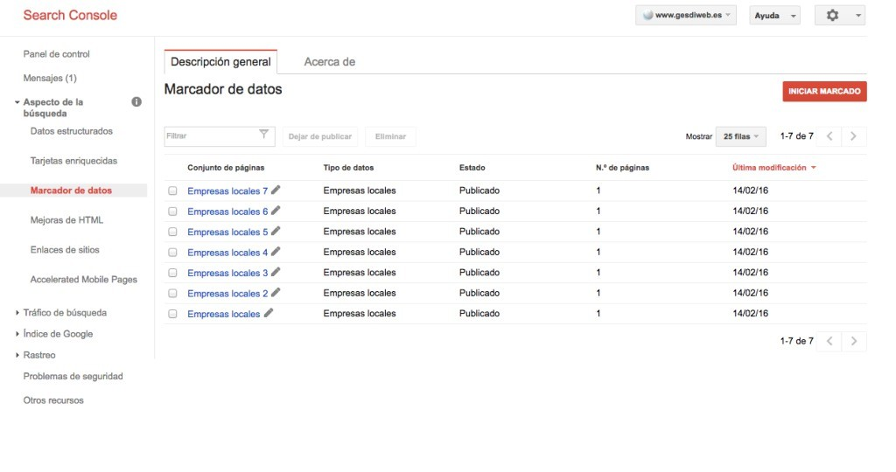
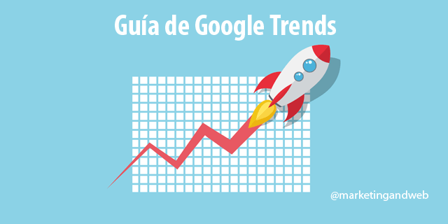

# Mejora el SEO local con Search Console y Google trends

**Los nuevos cambios que realizó el algoritmo de google repercutieron en las búsquedas a nivel local**, la actualización es de finales de 2014, o sea que google añadió otro animalito más, dentro de lo que ya se denomina \\”el zoo\\” de la compañía, puesto que cada uno de los algoritmos de los que se vale para optimizar las búsquedas lleva el nombre de un animal. En este caso, los más beneficiados fueron directorios que muestran búsquedas de índole local como [**Yelp**](http://www.yelp.es/ "directorio seo local"), **del cual se dice que es el principal responsable de que se haya producido el cambio al algoritmo Google Pigeon**.

## ¿Que es Google pigeon?

Los cambios del algoritmo de **Google Pigeon poseen como objetivo que los negocios locales**, que serán los que se vean afectados de manera negativa, **[desarrollen más su SEO](https://www.gesdiweb.es/posicionamiento-web-valencia/)** si no quieren ver cómo irremediablemente se hunden en las últimas posiciones de los resultados de búsqueda. De este modo se tendrán que seguir las condiciones que **impone el algoritmo Google Pigeon para optimizar una página**. Tal vez se tenga que recurrir igualmente a alguna campaña de pago para recuperar algunas posiciones, al menos al principio. Algunos se han atrevido a indicar que se trata de una vuelta de tuerca más del gigante de Internet para **conseguir aumentar el número de campañas locales de Adwords**.

Sea como sea, **la realidad es que el algoritmo de Google Pigeon vino para quedarse** e **incrementar así la calidad de los resultados seo locales**, algo que desde hace tiempo los de Mountain View atienden con gran interés.

## Como mejorar el SEO local con **Search Console**

En caso de disponer de un pequeño negocio, si se desea que la página web aparezca en los primeros puestos de los buscadores de los posibles clientes, será mejor que se tengan muy en cuenta los cambios del algoritmo de Google Pigeon implementándolos en una página cargada de contenidos, bien estructurada y limpia. **El SEO local es uno de los posicionamientos que más cuesta** de sacar adelante y por lo tanto, trabajar el posicionamiento correctamente para que seamos indexados mejor por Google Pigeon será esencial para que nuestra estrategia de SEO local sea una de las fuentes de tráfico más importantes para nuestro negocio. Por eso un consejo para potenciar vuestro Seo Local es utilizar **microdatos locales** ([aquí teneis un generador)](https://www.star-snippets.com/es/generador-de-rich-snippet.html), pero lo ideal es que realicéis el etiquetado con el marcador de **[Google Search console](https://www.google.com/webmasters/tools/), solo marcar las páginas que quereis potenciar a nivel local y rellenar todos los datos posibles.**

Por otra parte no olvides darte de alta en directorios importantes ( [google my busines](https://www.google.es/business/), [foursquare](http://es.business.foursquare.com/), [páginas amarillas](http://www.paginasamarillas.es/anunciate/inserciones) ….) y sobretodo directorios de vuestra ciudad o provincia.

**IMPORTANTE SIEMPRE DAR DE ALTA LOS MISMOS DATOS EN TODOS LOS DIRECTORIOS**

## Como mejorar las búsquedas locales con google trends

Si estáis empezando y aún no tenéis mucho presupuesto o es complicado encontrar palabras en herramientas como [Semrush](https://www.semrush.com/) o [sistrix](https://www.sistrix.es) (ya que no contempla muchas búsquedas locales),la herramienta gratuita [Google trends](https://www.google.es/trends) os puede ser muy útil ya que podéis explorar los distintos términos de búsqueda con los que queréis ser encontrados , os recomiendo que leáis alguno de estos **artículos sobre Google Trends**

### Google Trends: Guía completa + Videotutorial en Español(Claudio Inacio)

### Google Trends en Español – Guía Completa (Miguel Florido)

### Cómo usar Google Trends: explora tendencias en la web(Javi Ramos)

