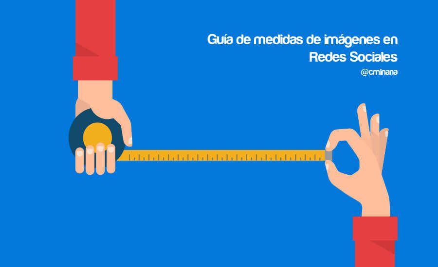

# 6 Herramientas para diseñar imágenes web y social media  

Si hay algo que, por lo general, lleva de cabeza a la gente es el **diseño de imágenes**. Hay personas que nacieron con mucho arte y otras –por no decir que ninguno- con poco arte. Y ahí está, el gran problema de todos: el **Social Media se basa en el uso de imágenes**.

Tal vez te pueda interesar este post de nuestro amigo [Carlos Miñana](https://www.linkedin.com/in/carlosminana), donde habla de algo imprescindible para cualquier social media y diseñador, el **tamaño adecuado de cada imagen dependiendo de la red social**:

## Guía de medidas de imágenes en redes sociales

Y seguimos al lio, vale sí, hay que redactar un “montonazo” de texto casi a diario, pero se nos olvida que estamos en la era de lo visual, que lo que más importa, al fin y al cabo, es tener toda la información a golpe de vista. De ahí que existan los titulares sensacionalistas, los arte –los que desarrollan las imágenes-, copys, etc. Sí, porque todo tiene que ser rápido y fácil de concebir.

El caso es que siendo **community manager o social media manager**, es muy común tener que **hacer contenido ilustrado**, es decir difundir el mayor número posible de **imágenes con texto**. Estas son las que más van a captar la atención de vuestros fans y followers. Ya sabéis: “**una imagen vale más que mil palabras**“. Por eso, con la intención de daros un empujoncito en este aspecto, os dejamos **6 herramientas que os salvarán el culo en el caso de que tengáis que crear muchas imágenes**.

Además de esto, todas estas herramientas os serán de gran ayuda para optimizar y [**posicionar tu página web**](https://www.gesdiweb.es/posicionamiento-web-valencia/ "Posicionamiento Web") y crear diseños increíbles con los que poder crear contenido innovador, que llame a la acción y que además quede estéticamente perfecto. ¿Qué os parece? Al igual que en marketing online, es importante que nuestra **página web** sea toda una experiencia para el usuario.

## Aquí te dejo las 6 herramientas más utilizadas

### [Adobe Creative Suite](http://www.adobe.com/es/products/catalog/cs6._sl_id-contentfilter_sl_catalog_sl_software_sl_creativesuite6.html)

Si te dedicas al **[diseño web puro y duro](https://www.gesdiweb.es/disseny-web-valencia/)** o sueles editar imágenes para la web el pack adobe es indispensable, si no puedes permitírtelo busca versiones viejas del archiconocido **[Fireworks](https://helpx.adobe.com/es/fireworks/topics.html)** (he dicho busca no descargas de forma ilegal xD), mucho más fácil de utilizar que **[photoshop](http://helpx.adobe.com/es/photoshop/topics-cs6.html)** e [**illustrator**](http://helpx.adobe.com/es/illustrator/topics-cs6.html), aunque cada uno es fuerte en un aspecto, para mi **Fireworks es el mejor para editar imágenes rápidamente** o realizar transparencias pngs, Photoshop para maquetar con CSS y illustrator para carteles.

### [Pinwords](http://www.pinwords.com)
Web app que te permite crear esas **imágenes con frases de motivación tan sumamente sencillas que veis por ahí**. Son estupendas para compartirlas en redes y poder crear diseños a la última haciendo que a tu núcleo de seguidores le apetezca interactuar con la marca. Muy sencilla de usar, intuitiva aunque en inglés. El único fallo que he de admitir de esta herramienta es que al finalizar la imagen y descargarla, el fichero os aparecerá con el logo de Pinwords.  

### [Quozio](http://quozio.com/)
Muy parecida a Pinwords. Lo bueno de esta es que aquí **puedes usar imágenes de archivo** que te permitan colocar también tu marca sin que se predetermine como fondo de imagen. **Intuitiva y perfecta si os falla una publicación y tenéis que salir de un apuro.**

### [Thinglink](<http://ThingLink: Make Your Images Interactive>)
Me encanta esta herramienta porque cuanto más patoso eres con la **creación de imágenes**, más se te complica el hecho de crearlas de forma interactiva. Con esta herramienta no tendréis complicaciones. **Es estupenda, sencilla y gratuita**.

### [Butonoptimizer](http://buttonoptimizer.com/)
**Mi herramienta preferida para crear botones**. A botones no me refiero a los de las camisas sino a botones para shops en internet o para página web en HTML. Impresionantemente fácil de utilizar y todo, ¡**sin tener ni idea de photoshop**! Lo mejor de lo mejor para crear botones que llamen a la acción y que hagan de la compra en vuestras **páginas web** mucho más sencilla y agradable.

### [Canva](https://www.canva.com/)

Mi herramienta favorita entre todas. Me encanta su uso, lo rápida que es y lo fácil de manejar que resulta. **Te da los formatos ya preparados según el tipo de contenido** que te interese para **crear las mejores imágenes**. Es totalmente **gratuita.** Os la recomiendo sin duda alguna porque os va a sacar de muchos apuros, sobre todo a la hora de crear covers, portadas para Facebook, imágenes para cualquier RR.SS, etc. ¡Un acierto seguro!

Las cosas son más sencillas de lo que muchas veces nos planteamos. Conseguir grandes diseño con un simple click y sin pagar (aunque no siempre**) es muy sencillo**.
