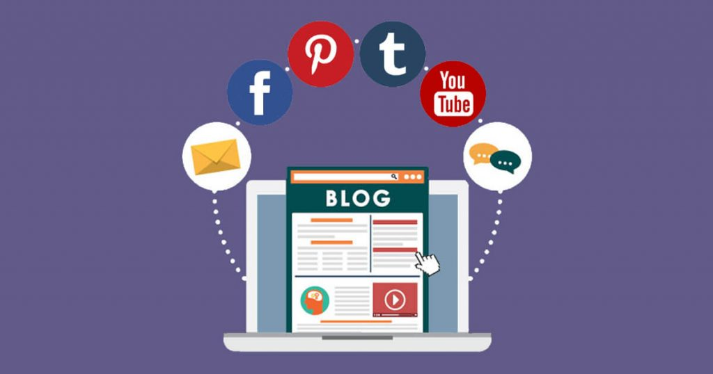

Me sorprende que hoy en día, todavía me encuentro hoy en día muchas empresas que pretenden vender y promocionar sus productos o servicios en Internet y no templan la posibilidad de tener un blog.  Muchos de estos empresarios, dicen que no les hace falta un blog para poder promocionar su negocio en Internet.

Si eres uno de ellos, hoy te voy a explicar la importancia de tener un blog para llevar a cabo cualquier estrategia de marketing online y qué puede aportar a tu negocio tener un blog.

## Atraer más público objetivo

Lo primero que debes hacer es ponerte en la piel de tu potencial cliente. Saber cuáles son sus dudas, sus preocupaciones, su dolor, sus problemas o incluso que es lo que no le deja dormir.

En marketing existe una regla que muchos la llamamos la regla 80/20. El nombre es debido a que, de todo el mundo que navega por internet o hace una consulta en Google, tan solo el 20% está preparado para comprar un producto o contratar un servicio. El 80% restante, no sabe aún lo que quiere o lo que necesita o ni siquiera si lo necesita. Tan solo está buscando información. Eso significa, que si en tu blog resuelves las principales dudas o das una solución a los problemas típicos de tus potenciales clientes, vas a poder atraer a ese 80% de usuarios restante.

## Compartir en redes sociales

Todo el mundo entiende, que para ejecutar una promoción online, las redes sociales juegan un papel muy importante. Para poder tener presencia en las redes sociales, primero que nada, necesitas una cosa. Necesitas contenido para compartir y a poder ser contenido interesante para tus clientes o potenciales clientes.

En esta parte es donde muchas empresas, se equivocan. Mucho dicen “No… es que yo no necesito un blog porque ya tengo muchos seguidores en redes sociales”, “No… es que yo llego a muchas más personas en redes sociales” o cosas por el estilo.

El principal error que comente, es que está publicando su contenido en una red social. Un sitio web, que no es de su propiedad, ni tiene el control de ella.

La mejor forma de aprovechar las redes sociales para atraer tráfico a tu negocio, es compartir en las en ellas el enlace al contenido de tu blog. En donde de momento no les estas vendiendo nada. Tan solo les estas informando o mostrando una solución a un problema.

De la misma manera que en redes sociales, también puedes compartir el enlace a ese contenido de valor en otros sitios, como en foros y sitios relacionados con tu sector o actividad.

## Te ayuda a posicionarte como un experto

Otras de los beneficios que te aporta tener un blog en tu negocio, es la de desmarcarte de tu competencia y posicionarte como un experto o un referente en tu sector. Eso no solo te hará más popular a ti, sino que también ayudará crecer como marca.

## Te ayudará a mejorar el posicionamiento en buscadores

Otra de las cosas que te aporta tener un blog y compartir su contenido, es que mucha más gente que encuentre que tu contenido es interesante o útil, van a compartir a su vez.

En 2018, la obtención de enlaces de otros sitios web de autoridad o de webs de tu misma temática, todavía es uno de los factores SEO más relevantes. Por lo tanto, si tus seguidores comparten en otros sitios tu contenido, generarás enlaces a tu web de una forma natural y como no, más trafico directo desde los sitios donde ha sido compartido. Esto ayudará enormemente a posicionar, no solo tus artículos de tu blog, sino también la parte de la web corporativa o tu tienda online.

## Que necesito para tener un blog

Lo único que necesita, es registrar un dominio (su precio puede rondar entre los 10 y 15 euros) y contratar un hosting (servidor web) que dependiendo de qué empresa, plan o tipo de hosting contrates puede variar el precio. Incluso muchas empresas de alojamiento web, ya te incluyen un dominio con una contratación anual.

Si tienes dudas, aquí puedes echar un vistazo para saber [cómo escoger un buen hosting](https://www.webebre.net/como-escoger-un-hosting/). Pero si estás empezando, probablemente con un plan de alojamiento básico que puede rondar entre 60€ y 100€ anuales deberías tener suficiente.

Después solo necesitarías construir el blog. Instalando algún CMS como podría ser WordPress, Joomla o Drupal, por mencionar los más populares, Tendrías el problema resuelto. Si en este apartado no te atreves o no ves capacitado, siempre puedes recurrir a alguna empresa de desarrollo web.

### Conclusión

Como puedes ver, los beneficios que puede aportar un blog a tu negocio online, son muchísimos. Hasta el punto que probablemente el blog es la base de cualquier estrategia de marketing online y los costes que puede suponer tener un blog es mínimo.
