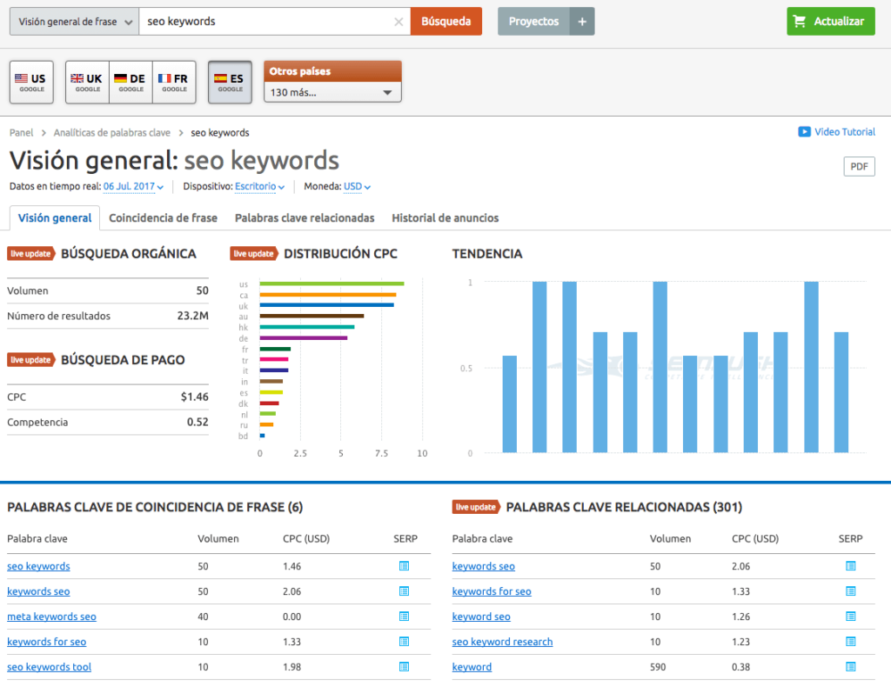

# Las 6 mejores herramientas para elegir las mejores keywords para tu estrategia SEO
Como siempre que hablamos de SEO, nos centraremos en el majestuoso e imponente Google para poder explicaros las cosas que son necesarias y más si se habla de keywords. Estas son l**as encargadas de situarnos en la cumbre de los resultados de búsqueda**, es decir entre los primeros resultados de entre los millones de páginas.

En una buena estrategia de **SEO**, el **Content** –o contenido- es **su mejor aliado**. El uno sin el otro no tienen mucho que hacer ya que crear contenido por crearlo no sirve de nada y darán igual las técnicas de Black Hat que usemos para el SEO si no se sostiene mediante el contenido. En cuestión de **Inbound Marketing**, el contenido es la pieza clave de toda estrategia.

Pero claro, el contenido de cualquier sitio web viene condicionado por las búsquedas de los usuarios y, lo que es más importante, mucho más condicionados por las palabras que se usen en dichas búsquedas, o sea las keywords. Para que **sepáis qué keywords es mejor evitar y cuáles necesitáis** usar sí o sí, os dejamos **cuatro herramientas para localizar las mejores keywords** –más allá del [Keyword Planner Tool de Google](https://adwords.google.es/KeywordPlanner)\-.

## Seis herramientas para encontrar las keywords más efectivas
### [Semrush](http://www.semrush.com/sem/?ref=0582864873)

La “archiconocida” semrush, su punto fuerte sigue siendo la búsqueda de palabras claves, posee otras funcionalidades pero en mi opinión aún tienen que ser pulidas. Para mi esta es una herramienta indispensable para cualquier profesional del sector, aunque no tenga un perfil orientado al SEO, puedes pulsar a la imagen para probarla gratis aunque de forma limitada.

### [Answer the public](http://answerthepublic.com/)

Una herramienta gratuita para encontrar ideas para nuestros artículos y palabras clave long tail ideal también para las campañas de Adwords, sobretodo para encontrar palabras negativas de búsquedas relacionadas con nuestros grupos de anuncios

### Video utilización Answer the Public

 

### [KeywordTool](http://keywordtool.io/)
¿Lo mejor de esta herramienta? ¡Que puedes **seleccionar** el **idioma** y el **país** en el que quieres que se centren las búsquedas! Esto es una gran ventaja, sobre todo si se están trabajando estrategias internacionales y nacionales de forma conjunta.

Otro de sus beneficios es que **añade long tails** –palabra clave largas- a tus búsquedas, aumentando tus opciones a la hora de conseguir una mayor variedad en tus keywords. Por otro lado, te permite **localizar las búsquedas de las keywords** en diferentes motores de búsqueda como Bing, Yahoo, Google, ¡e incluso Youtube!

### [KW Finder](https://kwfinder.com/)
Otra herramienta para la búsqueda de keywords muy recomendada es KW Finder. Esta herramienta online te permite **buscar keywords en países determinados** y en el idioma que tú más prefieras. Lo mejor de esta aplicación es que –de forma totalmente gratuita- **ofrece un gráfico** con un amplio abanico de posibilidades. Obtendremos por lo tanto un listado de sugerencias, el volumen estimado de búsquedas de cada una de esas keywords, el precio –CPC- y la competencia que tienen. Pero, ¡aún hay más! Esta herramienta te dice **quién está usando este tipo de** **keywords**, por lo que podrás conocer mucho más y mejor a tu competencia.

### [TinySuggest](http://www.tinysuggest.com/)
Esta herramienta es bastante convencional. En ella podremos contrastar la información que tenemos de nuestras keywords y de cómo se están utilizando. Sin embargo, esta herramienta online tiene algo que nos viene bien a cualquier redactor: ¡**construye frases con y a partir de esa keyword**! Muchas veces se nos hace un mundo el tema de escribir un título para nuestro artículo que c**ontenga las keywords necesarias pero que no parezca indio**. Usando TinnySuggest este peque.

i quieres que las cosas sean mejor y no acabar pagando un pico por tus acciones, lo mejor es que contactes con un profesionalño inconveniente tiene fácil solución.

### [Soovle](http://www.soovle.com/)

Aunque **no es un buscador de keywords** propiamente dicho, Soovle es una herramienta perfecta para ver qué está pasando en tiempo real. Muchas veces, lo que hoy vale al día siguiente ya no. Esta herramienta es la mejor opción para ver **cómo** y **dónde** **se están usando una serie de keywords** y cómo son sus longtails en los diferentes motores de búsqueda.

Y no solo se queda ahí, si no que analiza su uso hasta el Ask, Amazon, Wikipedia y Youtube.

Elegir de **forma** **correcta las keywords** que debemos utilizar tanto en nuestra estrategia de contenido como la de SEO y SEM, ya no es tan complicado. Eso sí, si quieres que las cosas sean mejor y no acabar pagando un pico por tus acciones, lo mejor es que contactes con un **[consultor seo](https://www.gesdiweb.es/posicionamiento-web-valencia/)**
