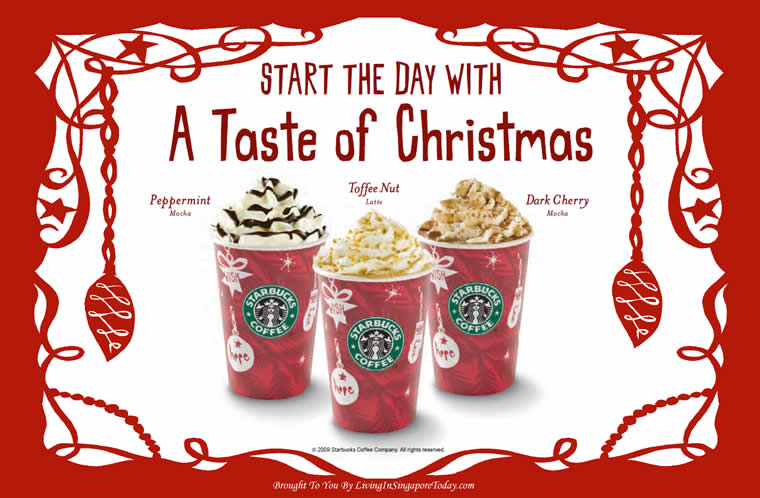

# Potencia y mejora tu campaña de marketing para esta Navidad
Aún sabiendo que muchos ya tendréis preparado todo el tema navideño porque ya no queda nada para llegar a las fechas más señaladas –y consumistas- del año, es muy probable que a alguno de vosotros se le hayan pasado algunas cosas en su campaña de marketing para esta Navidad.

Está claro que cada uno hace lo que quiere con su empresa y con su marca, pero la **Navidad es una época en la que muy pocos negocios se aventuran a arriesgar** pues, sin querer, las cosas ya vienen muy macadas y establecidas por estas fechas. A pesar de que el consumidor busca comprar, es cierto que no lo hace sin miramientos, sino que se suele fijar en esas marcas que, a pesar de tener precios más elevados, pues son mucho más cercanas a sus valores y compromisos. A pesar de que muchas personas solo cumplen sus compromisos una vez al año, suele darse que la gran mayoría lo hacemos en Navidad. ¿Por qué? Porque es la época del año, por excelencia, más emocional de todas.

Y sí, ahí reside la clave de cualquier campaña de marketing en Navidad: **las emociones.**

## ¿Cómo hacer tu campaña de marketing más emocional?
Suponemos que no te habrás perdido muchas campañas de marketig navideño en estos últimos años. Es un poco complicado, sobre todo teniendo en cuenta que una vez enciendes la TV es todo un ataque de anuncios, a cada cual más emocional y más moñas. Sí, ahí reside la esencia de la Navidad: la emoción, pero no la que te hace gritar de alegría, sino aquella que te remueve por dentro y te hace suspirar.

Aunque hay muchas campañas que apuestan por la alegría, el compartir y el vivir una época tan especial en familia, lo cierto es que aunque saquen estas emociones bonitas a flote, todas son emocionales hasta el punto de que a muchos nos hacen incluso llorar cuando las vemos. Muchas marcas han sabido explotar este campo a lo largo de los años, aunque a veces con altibajos, como por ejemplo [Loterías y Apuestas Del Estado](http://www.loteriasyapuestas.es/es). Pero en época navideña no es la emoción en los anuncios lo único que cuenta, sino que el consumidor empieza a pedirle mucho más a las marcas. Sí que es cierto que los anuncios como los de CocaCola, Apple, TMobile, etc, llaman mucho la atención por su emotividad, lo cierto es que esto ya no es lo único que importa y lo que más va a dotar a tu campaña de Marketing de esa esencia navideña y emocional. No ?

### VÍDEO LOTERÍAS Y APUESTAS DEL ESTADO 2016

Ahora, **lo que prima es la experiencia del consumidor**. Conseguir que él mismo sea el que cree esos pequeños spots a través de sus redes sociales, consiguiendo transmitir la esencia de la marca con fotos, gifs, vídeos, etc en redes sociales como Instagram, Facebook, Twitter…

Un caso que te puede servir de ejemplo es el de **[Starbucks](http://www.starbucks.es/)**, una cadena de cafés y bollería, en la cual hacen una campaña de marketing para Navidad que suele ser muy llamativa para el cliente. Como es obvio, en cualquier establecimiento, se decora y se prepara el local para que el cliente se sienta rodeado de ese ambiente navideño y acabe comprando gracias a la recreaciones de las emociones pero, entonces, ¿por qué Starbucks tiene que ser un referente para vosotros? Al fin y al cabo es una cadena de cafés a la que nunca le van a falta clientes, sea la época que sea ya que no solo venden un producto material, sino que es casi de primera necesidad social.

Pues bien, Starbucks no solo decora sus establecimientos para la Navidad, sino que además, cambia hasta su carta de productos, sus packaging y, por supuesto, el diseño de sus vasos y tazas. Todo ello va con frases motivadoras y decoración especialmente enfocadas, no solo a consumir un poco más, sino que, además, aluden a la esencia de que no solo son un café, sino que son un lugar de encuentro, un lugar donde compartir los mejores momentos durante todo el año, pero sobre todo en Navidad.

Sí, así se hacen las cosas hoy en día. Según los expertos, existen una serie de pautas que debe incluir tu **campaña de marketing para esta Navidad y que sea lo más efectiva posible.**

### Adecuarse al target
Tu público objetivo ya lo tienes claro –o al menos deberías tenerlo claro ya- y es imprescindible que te centres en ellos esencialmente. Sí, está claro que queremos siempre llegar al máximo número de personas pero hay que ser realistas. No se puede decir eso de “Quiero llegar a todo el mundo” porque es como decir que quieres que toda la galaxia te compre. Improbable. Por eso, hay que tener claras no solo las necesidades y deseos de tus clientes potenciales, sino que su personalidad es esencial. Está claro que vamos a apostar por la emoción navideña, por ese espíritu de compartir y de vivir cosas en familia, pero no todos vamos a usar el mismo tono. Por ejemplo, no vamos a usar el mismo tono si nuestra empresa es una [**tienda de playmobil**](https://www.elmundoclick.com/category/tiendas-playmobil/) que si es una tienda de juguetes eróticos para adultos. Por eso, es **muy importante saber cómo es nuestra comunicación y cómo es nuestro público en referencia a nosotros.**

### Conoce las emociones
Hay algo que no falla nunca: todos nos hacemos un lío con las grandes campañas de marketing. Es normal. Hay mucho que pensar, mucho que tener en cuenta y mucho que planificar, por eso, muchas veces intentamos sacar emociones por todos lados y se nos olvida que, **además de influenciar en las emociones de nuestros clientes, es muy importante no saturar**. De nada nos va a servir que nos pongamos a crear emociones a diestro y siniestro. Por eso, lo mejor que puedes hacer es crear un listado de emociones o valores que quieres destacar para tu campaña de marketing para esta Navidad. De es lista, empieza a descartar conceptos y quédate con los tres que más se ajusten a tu comunicación de marca y, por supuesto, a tus clientes.

### Los objetivos
Sí, algo que se pierde sin duda durante la época de Navidad es la perspectiva. Es normal que todos queramos conseguir más ventas, que todos queramos mejorar el ratio de conversión y que, por supuesto, nuestro negocio siga creciendo y prosperando. No es que sea un objetivo descabellado, pero no se ajusta a la esencia de la Navidad, por eso, es algo que no puede ser el centro de tu campaña de marketing para esta Navidad. Sé realista, ¿qué esperas además de conseguir dinero en esta campaña? ¿Fidelizar? ¿Conquistar a nuevos clientes? ¿Crear marca? **Esto es lo que realmente te va a decir cómo tiene que ser tu estrategia** para la campaña de marketing para esta Navidad, no te ofusques con nada más.

## Cosas que no pueden faltar en tu estrategia
Teniendo estos principios muy en cuenta, si ves que has fallado alguno, lo más seguro es que te toque replantearte tu campaña de marketing para esta Navidad un poco a correprisa. Sí, sabemos que puede ser difícil. Por eso, te dejamos con cuatro cosas que son esenciales para que tu estrategia funcione a la perfección y de principio a fin.

### Recrea el ambiente navideño
Es más que obvio que algo que no puede faltar en tu estrategia es recrear el ambiente navideño. Pero que conste que esto no puede ser únicamente en tu establecimiento –si es que lo tienes-. No, **debe ser en todo**. En tu logo, en tus redes sociales, en tus Newsletter, en tu web… en todo. Esto es por dos razones: para poner un poco en situación al consumidor y que sepa que está pasando, y, por supuesto, para ambientar tu marca y crear emoción a su alrededor.

Como ya os hemos dicho, crear emoción es esencial, por eso, intenta siempre poner imágenes, usar colores y olores que puedan seducir a tu cliente y llevarlo al **terreno más emocional para que se centre en eso** y no tanto en lo que está comprando.

### Haz regalos
Sí, sabemos que puede sonar un poco a locura porque estamos infringiendo una de las normas más básicas: en campañas de consumismo extremo ni se hacen descuentos ni se regala nada. ERROR. ¿Nunca te ha pasado que vas andando por la calle y ves que pone que algo es gratis y te has interesado solo por eso? Pues bien, ten en cuenta que la época navideña NO son solo los días más señalados, sino que la gente empieza a comprar –en serio- a principios de diciembre. O al menos a comparar. Si tú eres capaz de crear un buen recuerdo de marca regalándoles algo, una muestra, un caramelo distintivo, **LO QUE SEA**, estarás apostando por crear recuerdo de marca, lo que hará que el día de mañana acaben comprándote a ti ya que has conseguido crearles un buen sabor de marca.

### Haz RSC
Una de las cosas que más valoran los clientes es que se apueste por la Responsabilidad Social Corporativa, es decir que las empresas tengan algún tipo de efecto positivo en la sociedad. Y mucho más en estas fechas. Por eso, si en todo el año no has conseguido sacar adelante una campaña de RSC este es el momento. además de dotar a tu marca de una muy buena imagen, **conseguirás atraer la atención de muchos nuevos compradores que se sentirán conmovidos**. Por ejemplo, muchas empresas recogen ropa o juguetes ya que la Navidad es ese momento de bondad, el momento de dar. ¿Se te ocurre algo? ¡Hazlo!

### Ofrece servicios especiales
El cliente, lo que más quiere es ser el centro de tu mundo. Y en el fondo, tiene razón ya que sin él tú no vivirías ni serías nada, así que dale lo que te pide. Muchas veces, el ajetreo navideño nos hace olvidarnos un poco de que la atención al cliente es esencial en estos días. Al igual que la gente quiere dar, ser bondadoso, reír y ser feliz, **esperan que lo sean con ellos también**. Por eso, si tienes que ampliar la plantilla para estas fechas, ¡hazlo sin dudar! Aumenta tu servicio de atención Online, aumenta tu atención telefónica, atiende todas las dudas por mail que te lleguen. Y por supuesto, ¡siempre en el mínimo tiempo posible!

Recuerda que muchas veces se nos pueden complicar las cosas e írsenos de las manos, por eso, a veces en campañas de marketing tan importantes, es mejor **contar con un profesional** para que, al menos, te guíe en tu estrategia de marca.
