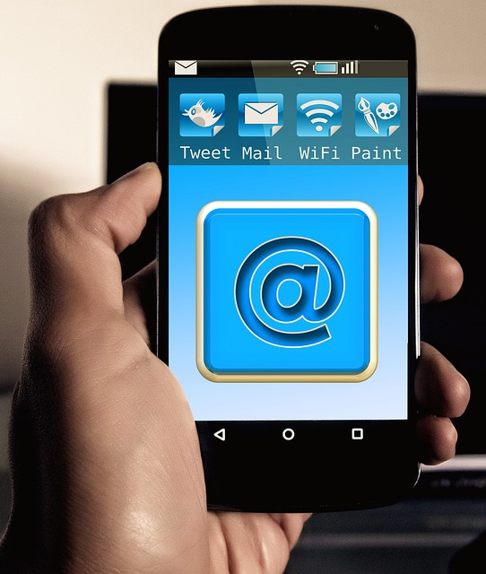

# Consejos para mejorar la tase de apertura de las Newsletter
Si te acabas de iniciar en esto del **[email marketing](https://www.gesdiweb.es/email-marketing/)** es muy normal que te preguntes ahora mismo qué es eso de la **tasa de apertura**. Básicamente es el **porcentaje de personas que han abierto nuestro email promocional**. Es, en general, lo que nos indica si hemos conseguido buenos resultados o no y, por lo tanto lo que nos enseñará si debemos cambiar nuestra estrategia y redacción en cuanto al email marketing.

Claro está que esta tase de apertura nunca se corresponde al 100%. Si te somos sinceros, ya es bastante complicado llegar a un 30%, ¡pero no te preocupes porque es muy normal! Por lo general, las empresas rondan entre el 10% y el 30%. Si crees que estás muy por debajo o quieres, simplemente, aumentar tu tasa de apertura de las Newsletter que realizas**, te dejamos con algunos consejos para que los pongas en práctica.**

## 4 cosas que debes hacer si quieres aumentar tu tase de apertura de las Newsletter
### Mantén tu base de datos actualizada
Uno de los mayores errores que se comete a la hora de usar el email marketing en la estrategia Online es que se confía en la buena fe de los usuarios. Es cierto que la gran mayoría se da de alta voluntariamente en las Newsletter pero… hay un gran número de suscriptores que simplemente dan falsos emails o emails desactualizados. Esto puede hacer que tu campaña cuente con bastantes bounced emails –emails rebotados- lo que hace que tu tasa de apertura baje mucho. Para tener datos realmente fiables, **elimina este tipo de emails de tu base de datos y mantente actualizado.**

### Asegúrate de que son fieles a tu marca
Es posible que, sin darse cuenta, algunos de tus suscriptores se hayan colado en tu lista de tu email marketing por error. Lo más normal es que, a la hora de comprar, tengas aprobada una casilla que se auto rellena para que se suscriban a los nuevos contenidos de la web –o sea, la Newsletter-, ¿no? Pues bien, hay muchos usuarios que no son conscientes de ello y se olvidan de quitar este tipo de aprobación. Por eso, nuestro consejo es que **uses el double opt-in** –el _doble permiso_\-. Esto consiste en que cuando un usuario se dé de alta en tu Newsletter, para estar 100% seguro de que luego no va a evitar a toda costa tus emails y te va a mandar a spam, le mandes un mail de confirmación con una URL. Verás como así tu tasa de apertura de las Newsletter mejora.

### Escoge el mejor momento para enviarlo
A pesar de lo que muchas empresas creen, los lunes y los viernes NO son el mejor momento para mandar las Newsletter. Esto se debe a que el lunes, la bandeja de entrada está a tope y es el día que se necesita para organizarse la faena de la semana, por lo que lo más seguro es que acabemos en la papelera. El viernes, casi, casi lo mismo: lo que se quiere es salir del trabajo y desconectar. Aunque está claro que depende del sector y de nuestra audiencia –no es lo mismo una boutique de moda que un fabricante de maderas-, es muy importante dejar de lado estos dos días. Lo mejor que podemos hacer para conocer nuestra audiencia es h**acer un Test A/B**. De este modo, sabremos qué tanda tiene mejor recepción y podremos mandar nuestras Newsletter en un mejor horario.

### Personaliza los email
Para que tu futura campaña tenga una buena tasa de apertura, es muy importante que el usuario **se sienta único, especial y muy, muy, muy, pero que muy mimado**. Por eso, es muy importante que personalicemos tanto el remitente como el cliente a quien le hablamos.

En cuanto al remitente, siempre es más interesante que te identifiques como una persona real. Haznos caso: ser un nombre comercial ya no llama la atención. Muchas veces, la tasa de apertura aumenta gracias al simple hecho de poner como remitente un nombre real, como por ejemplo “Elena García – Directora de compras”.

Además, personalizar tus emails introduciendo los nombres de tus usuarios es algo muy interesante que te ayudará a captar su atención. Empezar con un “Julio, ¿sabes lo que te estás perdiendo?” no es lo mismo que empezar con un tema generalizado.

Recuerda que, todos estos consejos van a depender de tu público, pero sí es cierto que, **bien implementados, te ayudarán a aumentar la tasa de apertura de las Newsletter.**
