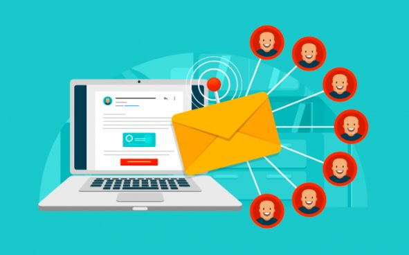

El e-mail marketing o mailing es una herramienta del marketing digital que usa el correo electrónico como principal instrumento. Se trata de enviar un mensaje cuidadosamente diseñado a un gran número de contactos.

Para ello, se necesita **una plataforma de gestión que ayude a manejar la base de datos y los envíos masivos**. La empresa Mailrelay es muy conocida por su excelente plataforma y ahora tiene una nueva versión con muchas ventajas.

# La nueva versión de Mailrelay

Entre las [**novedades en Mailrelay**](https://blog.mailrelay.com/es/2019/03/06/mailrelay-v3-primeros-pasos) está que no hay límites de envíos diarios. **La cuenta gratuita permite hacer 75.000 envíos al mes**, de esa manera, se puede diseñar la estrategia con total libertad.

Mailrelay ofrece, además, que **los mensajes están libres de publicidad**. Esto quiere decir que la cuenta es gratuita de verdad, no cobran ni siquiera con el añadido de avisos, esto es importante para mantener la imagen corporativa.

Otra ventaja de **la cuenta gratuita de Mailrelay es que gestiona hasta 15.000** contactos, es un número más que suficiente para una base de datos estándar. Permite realizar una campaña promocional completa.

Esta cuenta gratuita **no tiene límites de funcionalidades**, esto permite manejar muchas herramientas para sacarle el máximo provecho al e-mail marketing. Incluye la posibilidad de personalización de los mensajes, importación de contactos, crear grupos, etcétera.

La cuenta ofrece **soporte a través de un chat, ticket y por teléfono**, de esa manera se resuelve cualquier problema que surja, y **todo de forma gratuita**.

## Ventajas de hacer mailing masivo

- ## **Barato**. Es una herramienta muy económica, el coste se limita a la asesoría y el diseño de las newsletters. Hay opciones de cuentas gratuitas como la que ofrece Mailrelay con todo lo necesario para hacer campañas eficientes.

- **Gran accesibilidad**. El correo electrónico es un medio digital de comunicación muy extendido. Y además son gestionados a través de muchos dispositivos. Esto significa que cualquier cliente potencial podrá suscribirse a la base de datos y recibir las newsletters.
- **Bien recibidos**. Los boletines son aceptados de buen agrado debido a que el usuario accedió a recibirlos. Por lo general, se trata de datos de interés que el cliente utiliza por diversas razones.
- **Segmentación**. Se pueden enviar mensajes diseñados para grupos de clientes específicos. Por ejemplo, una tienda de ropa puede enviar mensajes diferentes a damas, caballeros y adolescentes, con productos dirigidos a cada grupo.
- **Medible**. El impacto de las campañas es totalmente medible, mediante herramientas como tasa de apertura, número de clics y muchas otras. Esto permite saber si estamos cumpliendo el objetivo, replicar los resultados positivos y corregir los negativos.
- **Versátil**. Los mensajes pueden incluir toda clase de recursos: imágenes, animaciones, sonido, etcétera. La creatividad del diseñador es el límite. También puede incluir enlaces que lleven a páginas o inviten a descargar archivos.
- **Rentable**. Debido a lo barato que resulta, el e-mail marketing es muy rentable. Si lo comparamos con campañas en otros medios, el mailing ofrece un gran retorno de la inversión. Por esta razón es altamente utilizado y se usa como campaña principal o como complemento.
- **Instantáneo**. El mensaje llega al receptor en el momento de hacer clic en enviar, por lo tanto, se tiene mayor control de la campaña.

## Consejos

- El usuario debe suscribirse a los boletines o dar su consentimiento de alguna forma. Esto no es sólo por razones legales, también es para que sea efectivo, la aprobación del usuario es lo que hace que lo abra y lo lea.
- **Mantén el mensaje simple y ligero, de esa manera no se sobrecargará a la vista del cliente**. Muchos elementos hacen que no se preste atención a nada y se deseche el mensaje.
- Es aconsejable invitar a realizar alguna acción, por ejemplo, hacer clic a un botón para leer más información o ver un vídeo.
- Se puede utilizar para realizar encuestas, pero hay que tener cuidado de no hacerlas muy extensas. Lo ideal es incluir una o dos preguntas, que además tome sólo unos pocos segundos.
- Utilizar el nombre y apellido del receptor, esto aumenta las posibilidades de que en efecto abra el mensaje. Está comprobado que las personas tienden a abrir un correo dirigido a ellos específicamente.
