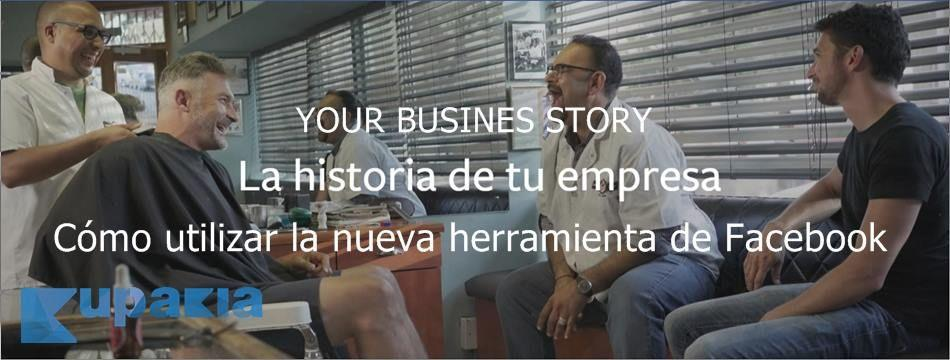

# **Tu estrategia de redes sociales será mucho más efectiva con estas novedades de** **Facebook**

Le preguntes a quien le preguntes, tiene presencia en Internet y más en redes sociales. Son pocas –por no decir poquísimas- las empresas que no están presentes en Redes Sociales, sobre todo en Facebook y Twitter y cada vez más en Instagram. Es cierto que muchas, al estar gestionadas a nivel personal y no profesional, no cuentan con las necesidades básicas cubiertas, como son el perfil bien creado, contenidos llamativos y útiles, etc. Esto puede causar algún que otro problema, pero más bien a nivel de comunicación y de imagen de marca, pero no por eso no se van a beneficiar también de las novedades de Facebook.

Sin embargo, muchas empresas no sepan realmente manejar sus redes sociales y no solo a nivel de comunicación, sino también de utilidad. Y más ahora, que parece que Facebook ha decidido crear toda una revolución tecnológica en todas sus redes sociales. **El poder de las redes sociales va mucho más allá** de lo que muchos se creen y aunque, al principio, no sirva para vender como todo el mundo quiere, son la mejor forma de trabajar la comunicación y conseguir crear marca, recuerdo de marca, cercanía con el usuario de Redes Sociales, mostrar empatía, etc. Todo beneficios que, si se saben trabajar de forma correcta, pueden hacer que tu empresa despegue y vaya alto con un poco de tiempo y paciencia.

Por supuesto, **las redes sociales van innovando e integrando nuevas utilidades** que benefician tanto a usuarios como a empresas y aunque pueden pasar años hasta que esto pase, lo cierto es que últimamente las novedades de Facebook son bastante recurrentes y típicas, aunque solo sea en cuanto a diseño y apariencia. Sin embargo, esto no ha sido lo último que ha pasado y por eso, queremos presentarte las novedades de esta red social para que sepas cómo podrás beneficiarte de ellas.

## Facebook Stories
Seguramente el tema de las stories os suena más si tenéis también una cuenta de Instagram. Está claro que en Instagram ha triunfado, sobre todo entre los más jóvenes que buscan, constantemente mostrarse de una forma nueva al mundo. Esto, por supuesto, también lo han sabido aprovechar las empresas, ya que Instagram Stories les permitía compartir no solo fotos en tiempo, relativamente real, sino que, podía hacer frente a vídeos en directo, minivídeos diarios, fotos, ubicaciones y menciones… ¡con durabilidad! Sí, como lo lees: **con un tiempo de vida de solo 24h.**

Si no lo sabéis, no hace mucho, Facebook se obsesionó con conseguir Snapchat y, la red social, se negó a unirse al Team Facebook. Desde entonces… ¡todo ha sido intentar parecerse y mejorar esa funcionalidad de Snapchat! Y así lo hizo Facebook: consiguió sacar adelante una versión mejorada de Snapchat que permitía a cualquiera ver todas las Stories, guardadas por 24h exclusivamente y, por supuesto, contactar con la persona que estaba haciendo el vídeo.

Pues eso mismo que vivimos hace unos meses en Instagram, lo estamos viviendo ahora mismo en Whatsapp y en Facebook. Aunque Whatsapp no es algo que nos venga a interesar mucho, lo cierto es que la funcionalidad es la misma que en Instaram: publicación de contenido multimedia en un perfil que cualquier amigo puede consultar en cualquier momento hasta 24h después de ser publicado el contenido.

Esta es una de las **novedades de Facebook más interesantes** más que nada porque, además de permitir compartir fotos y vídeos casi en tiempo real, te permitirá compartir estados de ánimo, hashtags y geolocalizaciones, algo que **puede beneficiar mucho a tu negocio en un futuro no muy lejano**. Además de compartir contenido real y veraz, lo que estás haciendo es animar a tu círculo de fans a centrarse no solo en el producto que enseñas, sino que le das la oportunidad de acercarse de una forma mucho más directa a él. Sin embargo, esto no es factible hacerlo aún por una sencilla razón: **Facebook Stories no está habilitado aún para páginas, sino que solo para perfiles**.

Sin embargo, como buenos estrategas, sabemos perfectamente que, si esto tiene buena acogida entre los usuarios -algo que está todavía por ver ya que muchos se están quejando de que Stories ya no es tan buena idea si va a estar en todas las redes sociales de Facebook-, esto se trasladará a la opción de Pages y, por supuesto, le dará a la empresa un aire nuevo y mucho más refrescante.

Aunque tienes la opción de [**Your Business Story**](http://www.kupakia.com/your-business-story-nueva-herramienta-video-en-facebook/) para tu negocio, pero funciona de manera diferente, disponible solo para páginas profesionales, con la que podrás potenciar tu imagen de marca a través de la creación de un sencillo **vídeo de branding**.

## Rol de colaborador de transmisión en Facebook
¡Cómo no podía ser de otra manera! Aunque las páginas son algo así como el último mono para Facebook, está claro que algo que salvó de “la muerte por aburrimiento” a las páginas. Por eso, hace unos meses, Facebook lanzó su opción de vídeos en directo para que las Fan Page también tuviesen una oportunidad de llamar la atención de sus consumidores y no morir en el intento. Sin embargo, esto no era tan buena idea para las Páginas grandes, con muchos empleados y muchas direcciones estratégicas en cuanto a comunicación diferente. ¿Por qué? Porque para que se pudiese retransmitir desde varios sitios o localizaciones –por ejemplo- el administrador de la página debía de estar físicamente allí o, si no, se debía dar acceso a la página como Administrador, algo que podía comprometer, a veces, la estrategia de la empresa, claro. Esto pasaba, por ejemplo**, muchas veces cuando se intentaban hacer campañas con influencers**, donde la empresa debía cederles derechos para que pudiesen hacer promociones en directo desde su propio canal.

Por eso, una de las novedades de Facebook ha sido lanzar un nuevo rol de página: **el de colaborador de transmisión**. Aunque parezca complejo de entender, no lo es. Lo cierto es que pertencer a este rol es perfecto: puedes acceder a alguna funcionalidades como editor, pero sin tener los mismos permisos y sin alterar el resto de publicaciones. Como con todos los roles de las páginas de Facebook, sigue habiendo un pequeño problema: **tienes que ser amigo de la persona** a la que quieres hacer colaborador Aunque seguramente esto cambie, lo cierto es que puede complicar un poco las cosas en las estrategias online, sin embargo, es algo que –para nuestra tristeza- se escapa a nuestro control.

Y sí, lo creas o no, este nuevo rol es una de las mejores novedades de Facebook porque te va a permitir difundir contenido que antes no podías sin comprometer tu seguridad y tu configuración de página. Por supuesto, es muy importante que entiendas que aunque pocos, el contribuidor de la transmisión puede seguir accediendo a tus opciones, aunque son muy limitadas. Por supuesto, el contenido que grabe este colaborador permanecerá en tu **Time Line a no ser que decidas eliminar la publicación y hacerlo desaparecer**.

Otorgar el rol de colaborador de la transmisión es muy sencillo e igual a crear un nuevo rol: en configuración, en el apartado de “Roles de página” deberás elegir el nuevo rol de colaborador de transmisión y listo. Sencillo, fácil y muy práctico cuando se quieren hacer campañas colaborativas entre marcas o con tu audiencia en general.

Por supuesto, aunque estas novedades de Facebook son una maravilla para las empresas, **es esencial que estas sepan trabajar la comunicación**, ofreciéndole al consumidor no solo contenido variado, sino –sin dudas- contenido de calidad, valores de marca, empatía, etc.
