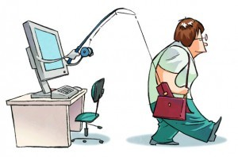
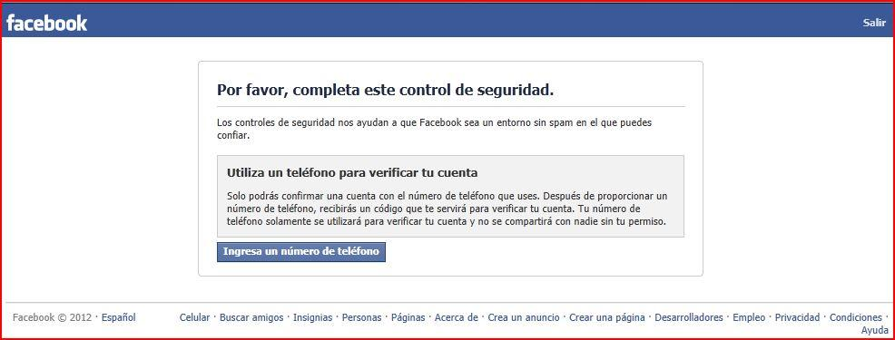
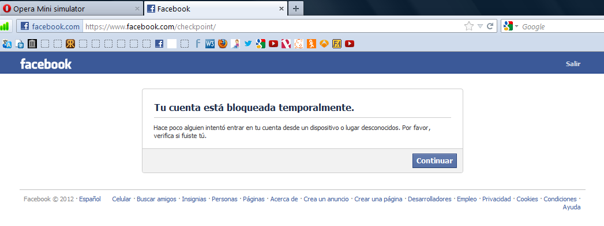
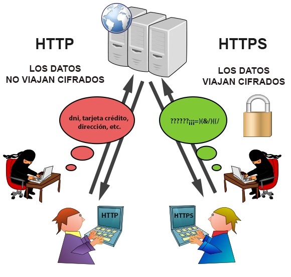

# Cómo evitar que te hagan phishing en redes sociales

Desde hace unos años, uno de los mayores problemas **de las redes sociales está siendo el phishing**, es decir la sustracción de datos personales a través de las redes sociales. Esto sucede ya que, cada vez, nos exponemos más y más –mucho más de lo que los expertos recomiendan- en este tipo de redes.

Esto, consigue que **los delincuentes cibernáuticos** tengan mucho más material con el que trabajar. Aunque nos alarmemos cada vez que sucede algo así, es muy lógico que los ladrones, sean físico u online, disfruten más de nuestra información ya que nosotros mismos lo permitimos.

En general, esta práctica se lleva a cabo en innumerables cuentas de redes sociales y en todas, aunque es cierto que hay una que, particularmente, se lleva la palma. **Facebook es la red social donde más phishing se está haciendo** ya que es la RR.SS donde más se comparte, se publica y, por supuesto, se interactúa. Esto hace de Facebook la red social más llamativa para todos estos delincuentes cibernáuticos que hacen de esta red social su laguito de pesca personal.

## ¿Qué es el phishing?

Hablar del **phishing** está muy bien, pero no todo el mundo sabe en qué consiste esta práctica, aunque se puede deducir perfectamente. Este término es una adaptación de fishing –pescar en inglés- ya que, al fin y al cabo, se hace lo mismo que en un lago: **pescar información de pececillos desorientados**.

Las personas que se dedican a esto –los denominados phishers- buscan, principalmente, datos personales, fotografías y demás información que les permita suplantar la identidad. ¿Con qué fin**? Básicamente buscan realizar robos a terceros.**

Como ya comentábamos con anterioridad, en Facebook esta práctica se está llevando a límites insospechados ya que es el sitio donde los phishers pueden conseguir cantidades ingentes de información de los diferentes usuarios.

De este modo, **los practicantes del phishing** –alejados de los habituales y muy conocidos hackers- **consiguen crear webs** y **perfiles falsos** con los que pretenden estafar al usuario y, si se tercia, estafar a entidades bancarias dando sus datos. Así pues, muchos usuarios se encuentran con gastos, desfalcos y demás problemas en sus cuentas bancarias, así como usurpaciones de identidad en casi todas las redes sociales, llegando a Whatsapp.

### Algunos datos del phishing en Facebook

- El 22% de las estafas por phishing se hacen a través de Facebook.
- El 35% o más de estas estafas involucra la creación dewebs falsas que se hacen pasar por Redes Sociales y así captan al usuario.
- Diariamente, alrededor de 20.000 clics se hacen a enlaces que redireccionan a páginas falsas.

## Cómo evitar el phishing en Facebook

Teniendo en cuenta los datos anteriormente citados, es muy normal que todos queráis **ponerle solución al tema y libraros del phishing**. Los consejos que os dejamos son, principalmente, para hacerle frente en Facebook aunque está claro que es extrapolable a cualquier red social.

### Evita los email

Una de las técnicas más usadas es el envío de mail –e incluso sms- en el que se nos pide que se responda al mismo con datos personales. **NO LO HAGAS NUNCA**. De hecho, bloquea al remitente y, en el caso de que se haga mediante sms, comunícaselo a tu operadora.

### Activa la autentificación de doble factor

Con esta pequeña acción, conseguiremos bloquear nuestro perfil y si pretendemos acceder a él sin tener la contraseña guardada –supuestamente en un ordenador de confianza-, **la propia red social Facebook nos enviará un código a nuestro móvil** para que validemos el acceso. Por supuesto, esto limita mucho la extracción de datos en Facebook por parte de los phishers.

Ahora ya no es tan necesario utilizar esta autentificación ya que facebook detecta los accesos no habituales desde otras ubicaciones o países distintos al habitual y bloquea tu cuenta temporalmente

### Cerciórate de que son páginas seguras

Por lo general –y no es de extrañar- estamos muy mal educados en cuanto a seguridad cibernáutica. Por lo que, **para no ser objeto de phishing, lo principal es que SOLO demos nuestros datos personales a páginas webs seguras**. Para saber si una web es segura o no, fíjate si al principio de la misma hay un https:// o un icono en forma de candado cerrado verde en el _hueco_ de la URL, eso hace que los datos estén cifrados **(certificado SSL)**

[Pulsa aquí para leer más sobre el certificado SSL en la OSI](https://www.osi.es/es/actualidad/blog/2014/02/28/que-pasa-si-una-pagina-web-no-utiliza-https.html) 

### Denuncia inmediatamente

En el caso de que veas algún movimiento raro, una publicación o un mensaje que no recuerdas, informa de inmediato a la policía y a tu banco. Es la mejor forma de curarse en espanto por si hubieses sido víctima del phishing.

### Actualiza el antivirus

Por mucho que tengas un Mac o un Windows, es imprescindible que tengas actualizada la versión de tu antivirus. Con esto te aseguras de que los parces de seguridad que coloca tu antivirus están al día y que pueden hacer frente a este tipo de ataques.

### No hagas click en enlaces que te piden tus datos personales

Este consejo es bastante de sentido común, lo sabemos, pero aún así parece que a mucha gente se le olvida. Es de vital importancia que NO demos nuestros datos en ninguna web que no conozcamos o que no sea segura ya que es un **ventanal de acceso para los phishers.**

Sabemos que estos consejos son básicos pero muy pocas personas los aplican aún cuando **el phishing es la actividad delictiva más instaurada en el mundo virtual y sus comunidades.** Además, es importante estar al tanto ya que cada día es más complicado encontrar a estos estafadores ya que sus técnicas de intrusismo evolucionan y perfeccionan a diario.
