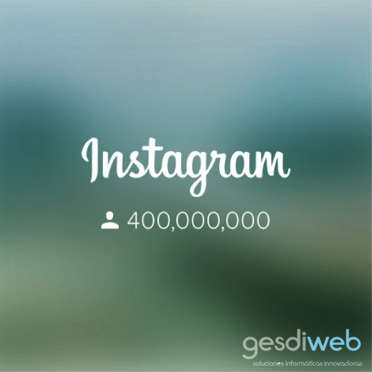
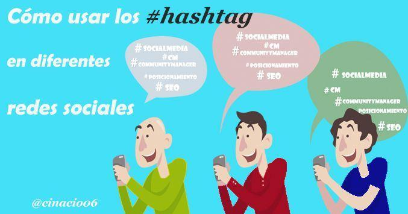
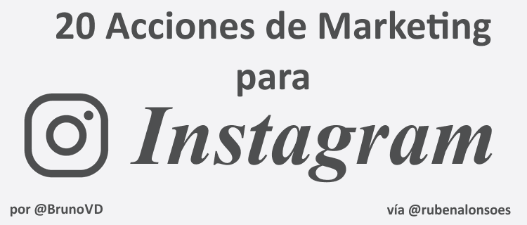

# Cómo posicionar en Instagram tu contenido
Cada vez más empresas están empezando a implementar el **uso de Instagram** en su **estrategia de marketing online**. Esta red social es, de hecho, una de las más usadas por la gran mayoría de los usuarios. Esto se debe a que, gracias a la inmediatez –aunque no la de Twitter-, todos estamos conectados a lo que hacen los demás.

Al igual que el resto de las redes sociales, Instagram se ha visto beneficiada por haber sabido diferenciarse. Por supuesto, esto puede ser positivo o negativo para tu empresa si sabes **cómo gestionar este tipo de [redes sociales más visuales](https://www.gesdiweb.es/redes-sociales-visuales/)**. Esto, por supuesto, hace que tu competencia sea mayor y que posicionar en Instagram tu contenido sea un poco más complicado.

Pero, como siempre**, existen una serie de trucos o argucias** que, bien implementados, te ayudarán a destacar de tu competencia y marcar la diferencia entre todos ellos.

## 3 consejos para posicionar en Instagram tu contenido de manera eficaz
### Hashtags

Si hay algo que nosotros detestamos es el **abuso incondicional de los hashtags.** Está claro que es una forma perfecta de posicionar en Instagram tu publicación, pero de ahí a que uses 50.000 hashtags hay un paso. Los hashtags te permiten segmentar, según gustos e intereses y conseguir que los usuarios que están buscando x te encuentren con mayor facilidad, pero claro, no hace falta tampoco abusar. Nuestro consejo es que, como en el SEO, te centres en el uso de **hashtags longtail** y que tengan que ver realmente con la publicación que estás promoviendo. Si subes una foto de un perro bailando, no coloques un hashtag de #motocross, por ejemplo. Con un máximo de ocho hashtags por imagen, conseguiréis vuestro propósito.

Si quieres profundizar mas en el tema no te pierdas este post:

### Cómo usar los hashtags en diferentes redes sociales

### Hazte amigo de influencers
No hay nada mejor para apoyar a una marca que un influencer. Esta es una de las estrategias que más están siguiendo las marcas en las redes sociales. Lo creas o no, es una muy buena forma de posicionar en Instagram, pero claro puede ser una estrategia bastante cara. A pesar de ello, es una manera menos intrusiva de acercarte a tu público objetivo ya que los usuarios **suelen confiar mucho en los influencers**. Por lo general, las marcas suelen ofrecerles productos gratuitos para que sean embajadores de la marca, como por ejemplo ocurre con [Jorge Cremades](https://www.instagram.com/jorgescremades/?hl=es) o [Sergio Peinado](https://www.instagram.com/sergiopeinadotrainer/?hl=es). Sinceramente, es algo que a tu marca le puede dar el empujón que necesita para seguir aumentando posiciones y, por supuesto, darte más rentabilidad.

### Ojo con pasarte con las publicaciones
Otro error que suelen cometer las marcas es no ser conscientes de la cantidad de imágenes que se suben. Algunas marcas pecan de excederse –y mucho- mientras otras se limitan a hacer las justas. Lo más importante para poder posicionar en Instagram tu marca es que SIEMPRE tengas presente que tus usuarios quieren una continuidad. En Instagram, por lo general, se recomiendan un **par de actualizaciones al día** y, siempre, teniendo en cuenta qué temática trabaja tu marca. Ten en cuenta que, abusar, lo único que hará es que tus seguidores te vean como spam y los pierdas. Además de esto, es importante controlar los picos de afluencia: primera hora, medio día, media tarde y noche. Sobre todo la noche. Ten en cuenta cuándo tus publicaciones tienen más likes y entonces encontrarás el momento más indicado para publicar.

Por supuesto, antes de hacer cualquier acción que te ayude a posicionar en Instagram tu contenido, debes tener en cuenta que tu estrategia es lo más importante de todo. **Sin una estrategia clara y controlada, no conseguirás posicionar en Instagram tu marca**.

Bonus:

## Bonus:20 Acciones de Marketing para Instagram

