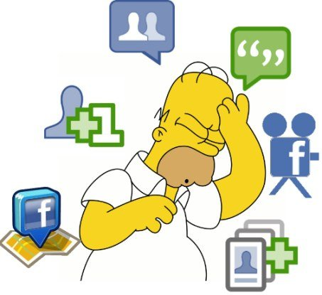

# Errores en redes sociales que debes evitar
Aunque no lo parezca, las **redes sociales son un terreno que pocos saben manejar** de la forma correcta, como a nosotros nos gusta llamar es un “**terreno de juego algo pantanoso**”. **[Cometer errores en la autogestion de redes sociales es lo más fácil](https://www.gesdiweb.es/autogestion-redes-sociales/)** que puede pasar y eso puede llevarnos a meter la pata hasta lo más profundo de las arenas movedizas, **viralizándonos** de la forma más negativa posible –**como con un Trending Topic negativo** a lo David Bisbal o Sergio Ramos-.

Hay que tener en cuenta que las redes sociales son un medio completamente transparente –o al menos eso se presupone- ya que es el usuario quien impone las reglas del juego por lo que borrar nuestras huellas del delito no es lo único que debemos hacer.

Para los que os estáis iniciando en este mundo, ya sea a nivel profesional, [redes sociales de empresas](https://www.gesdiweb.es/redes-sociales-pymes/) o vuestras redes personales o en vistas de trabajar la comunicación de vuestra marca, os dejamos algunos de los errores más comunes en redes sociales para que vosotros no los cometáis también.

## [Los 8 errores más comunes en redes sociales](https://www.gesdiweb.es/redes-sociales-errores/)
### Usar un perfil personal para una marca
Uno de los **mayores errores** que puede cometer es **crearse un perfil personal en cualquier red social**. Lo que hay que hacer siempre es crear un perfil profesional –una Fan Page en el caso de Facebook, por ejemplo-. Esto es un gran error ya que se desperdician muchas oportunidades –hacer concursos, abrir un foro, redireccionar a la web de la empresa…-, pone en peligro la reputación de la marca ya que se puede considerar engaño al consumidor, y alguna redes pueden cerrar dichos perfiles porque marcas comerciales no puede representar un perfil personal.

### Abusar de la automatización
Una de las **mejores herramientas** para trabajar el social media es **[Hootsuite](https://hootsuite.com/)**, sin embargo este tipo de aplicaciones puede hacernos confiar en exceso en la automatización y esto hace que muchas veces no se esté tan pendiente como se debería. Además, el exceso de automatizaciones puede hacernos quedar como un robot y además dar sensación de desactualización pro no estar conectados con la actualidad del momento.

### Preferir cantidad a calidad de followers
Un error más que común de cualquier marca es **exigir muchos seguidores sin importar la calidad de los mismos y en redes sociales ya no es una cuestión de cantidad, sino de calidad**. De nada nos van a servir miles de seguidores si a ninguno le interesa realmente nuestra información y no es participativo. Lo importante es relanzar la marca, hacerla interesante y sugerente para los fans o followers, sin importar el número.

### Falta de planificación estratégica
**Cada público es diferente** y aunque se puede tomar referencia de otras marcas para **trabajar nuestras redes sociales**, no se debe plagiar pues puede que a nosotros no nos funcione. Además no tenéis porque elegir las redes sociales que elije todo el mundo, puede ser que vuestro negocio se oriente a [redes sociales mas visuales](https://www.gesdiweb.es/redes-sociales-visuales/) ( youtube, pinterest, instagram..) .**Siempre** se tienen que tener **objetivos y acciones claras**, siempre **pensando en cómo es tu público** para trabajar el tipo de contenido con el que más cómodo se sienta. Pero recuerda que **lo principal** es que consigas **transmitir** tu **esencia** y **personalidad** de **marca** en tus perfiles de las **redes sociales**.

### Falta de variedad en los contenidos
Está claro que, dependiendo de la marca, transmitiremos más un tipo de contenidos que otros, pero como bien dice el dicho “en la variedad está el gusto”. Por eso es muy importante que se le aporte dinamismo al perfil en redes sociales combinando imágenes, vídeos, preguntas, concursos, etc.. ¡**No dejes que tu canal se haga monótono y aburrido**!

### Usar las redes sociales para hacer spam
**Nadie quiere una publicación publicitaria** en sus redes sociales que no ha solicitado. Una cosa es que uses publicaciones para agradecer a tus followers su apoyo a tu marca y otra muy diferente que vayas haciendo publicidad no deseada. Para entenderlo es muy importante ponerse en la piel de nuestro seguidor y saber qué es lo que le puede llegar a molestar para no perderlo ni como fan/follower ni como consumidor.

### Dejar tus perfiles en redes sociales en manos de cualquiera
Muchos profesionales que nos dedicamos a este sector hemos escuchado la frase que dice…

“**Es que mi hijo –o sobrino, o primo, o vecino…- es muy de usar Facebook**”.

Sinceramente, nosotros no podemos evitar sentirnos completamente frustrados. La persona que **gestione las redes sociales** debe estar cualificada ya que es la que va a dar la cara por la marca. Tienen que saber cómo gestionar las redes sociales a nivel profesional, conocer y entender la comunicación –de marca sobre todo- al dedillo, y conocer en profundidad el mundo del marketing online y la gestión del contenido. Es esencial que se trate de un profesional ya que esto es lo que, al fin y al cabo, **le aportará valora, reputación y una buena imagen**. Lamentamos deciros que esto… ¡**no es capaz de hacerlo cualquiera**!

### No gestionar las críticas
No responder a las consultas o las quejas de nuestros fans o followers está tipificado como _delito_ por los profesionales del marketing. De nada nos va a servir **borrar las quejas**, [hemos de hacer frente a los trolls y clientes descontentos en redes sociales](https://www.gesdiweb.es/troll-en-redes-sociales/), aunque no les hagamos caso más tarde, es esencial **contestarlas para no dar un mala imagen**. El buen servicio al cliente es esencial en redes sociales ya que es un **mundo que se mueve a tiempo real**. Está claro que todos tenemos un horario, pero hay que ser capaces de reaccionar lo más rápidamente posible. Los usuarios satisfechos son los mejores prescriptores de marca que podemos conseguir en redes sociales.

Ya veis que son comportamientos básicos, los cuales tendríamos, en su gran mayoría, en nuestra tienda física. Al fin y al cabo, **las redes sociales son un medio** **más**, **un canal más de comunicación con el cliente** y esto es lo más importante para **trabajar nuestra imagen y reputación de marca en redes sociales.**

## [Bonus : Ventajas y desventajas del uso de redes Sociales](http://www.marketingandweb.es/marketing/ventajas-desventajas-de-las-redes-sociales/)  

