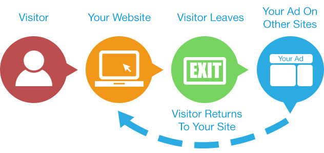
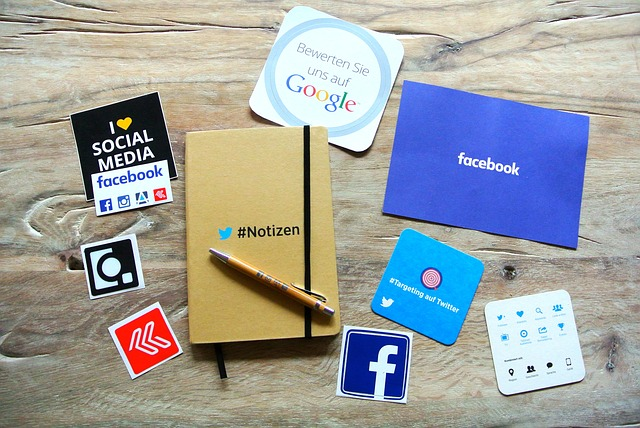

# Usa el remarketing como herramienta de ventas
Hoy en día, todo aquel que tenga una web y una estrategia en Social Media, tiene que conocer Google Adwords, Facebook Ads y Twitter Ads y aunque no lo haya usado de forma directa, debe conocer cómo funciona o al menos saber qué hace. Aunque todas ellas son muy efectivas, **la herramienta que realmente potencia mucho las ventas en Internet es el remarketing**.

## ¿Para qué te va a servir el remarketing?
Cuando compramos por Internet todos somos muy indecisos. La probabilidad de entrar en una web y comprar a la primera, sin mirar otras cosas, comparar precios y pensarse las cosas es bastante improbable. Esto solo ocurre si se conoce el producto, ya sea porque lo han recomendado o porque conoce mucho el producto gracias a otro tipo de medios.

El remarketing nos puede ayudar en este sentido ya que, al consumidor, **hay que recordarle constantemente tu producto o servicio**. A pesar de que entre en tu web y salga, es mejor si le recordamos constantemente que estamos ahí para que, en un futuro no tan lejano, compre en la web antes que en la de la competencia.

El remarketing, no solo aumenta las probabilidades de venta recordándole al usuario que estamos ahí para él, si no que, además, **la publicidad de remarketing es más rentable que la publicidad normal**. De hecho, ya no es solo por el precio del anuncio si no porque estamos impactando, de forma directa, en internautas que ya han accedido a la web con anterioridad, por lo que el gasto es mucho más rentable que si nos dirigimos simplemente a aquellos usuarios que no nos conocen.

En muchas ocasiones, se puede reducir el gasto por lead hasta el 50% ya que captar nuevos usuarios suele ser mucho más caro que impactar en aquellos que, aunque sea de forma rápida, ya han visto nuestra web.

## Consejos para aprovechar el remarketing
A pesar de que es muy útil, **el remarketing no es tan fácil de implementar** como una campaña habitual de Facebook Ads, Twitter Ads o Google Adwords. Además de saber utilizarlo, se tiene que saber darle la vuelta y darle un toque único.

### No lleves al usuario a la misma página
Si ya usaste la Home como página de aterrizaje y los usuarios entraron pero no convirtieron, ¡no los vuelvas a llevar ahí! Llévalo a una página en la que el usuario se sienta más cómo, una en la que puedas eliminar sus dudas y lo incentives a la compra. Estas pueden ser el blog o, incluso, una página con una promoción exclusiva para aquellos que vuelven a visitar tu web. Crea distintas landings para cada finalidad o producto, aquí puedes ver **[herramientas de diseño web para crear una landing page](https://www.gesdiweb.es/crear-una-landing-page/)**

### Haz remarketing selectivo
Está claro que todos queremos llegar a todo el mundo pero hay que tener en cuenta que, a veces, es inalcanzable. Por eso, es mucho más recomendable ir seleccionando a los usuarios que impactar según los gustos. Por ejemplo, si se quieren aumentar las ventas de un producto o servicio en concreto, es mejor que se seleccionen a los que han visitado dicho espacio en la web. De este modo, convertirán pues se sentirán atraídos por lo que les muestras. Además, es muy **importante personalizar los anuncios de remarketing** para que así funcionen mejor.

### Aumenta la venta cruzada
No solo se puede hacer remareketing a personas que no han comprado porque si no estaremos tirando el dinero porque no podemos estar seguros de que compren. Por eso, es recomendable que en **la campaña de remarketing busquemos tanto a personas que ya han comprado como las que no**. De este modo, podremos ofrecer un servicio más personalizado, como por ejemplo un descuento que incentive la compra de clientes y no clientes.

### No te pases con la frecuencia
Estamos de acuerdo en que el remarketing funciona y muy bien, pero no se puede hacer cada día. Por eso, es importante que se le muestre un solo anuncio a los usuarios y no 20 en una misma semana. De este modo, tu remarketing será mucho más efectivo.

### Diseña banners e imágenes
En las estrategias de **remarketing, es necesario diseñar imágenes, [aquí puedes ver como diseñar imágenes de manera sencilla](https://www.gesdiweb.es/imagenes-creacion-paginas-web/),** pero no uses las que ya has usado en anteriores campañas porque el usuario no es tonto y tiene memoria, por lo que puede confundir la campaña y creer que es una anterior. Trabajar con imágenes es mucho más efectivo, sobre todo para captar la atención de tus usuarios para que vuelvan a entrar en la web y si no quieres diseñar tal vez te interese utilizar **[bancos de imágenes gratuitos](https://www.gesdiweb.es/bancos-de-imagenes/)**
