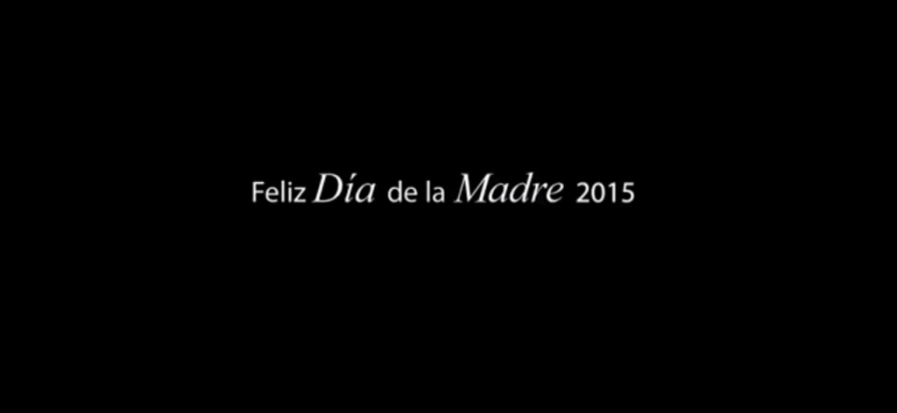

# 5 Requisitos para que los vídeos puedan ser virales
### Algo divertido
Un buen video siempre, siempre y siempre te tiene que **hacer reír o al menos emocionar de alguna forma**. Debe suscitar en ti una emoción positiva ya que de esta forma es en la que se almacenan los recuerdos. Sí, los momentos negativos están más presentes, pero ninguna marca quiere vincularse a algo verdaderamente triste o negativo. Por eso, siempre van marcados con alguna _gota_ de humor.

### Extremadamente emocionales
Almacenamos recuerdos según las emociones que experimentamos y si un vídeo **nos llega al alma**… ¡la viralidad está asegurada! Todo **buen vídeo viral** tiene un toque sensiblón que te hace suspirar o llorar –depende de lo emotivo que seas-.

### Tiene que incluir algo de tu día a día
Ninguna marca puede dirigirse a todo el mundo. Al menos las pequeñas, si nos ponemos a hablar de Coca-Cola sí. Sin embargo, cada vídeo **está destinado a un público** y en él se narran cosas de ese público en concreto. Todo buen **vídeo viral** debe contener algo con lo que la gente pueda reconocerse de forma instintiva y automática.

### Debe ser corto
No hablamos de un Vine, por ejemplo, que solo dura 30 segundos, pero no queremos tampoco vídeos de cinco o diez minutos. La idea es **concentrarlo todo en tres minutos como máximo**. El golpe de emociones tiene que ser sucesivo pero rápido, con un buen ritmo y con cosas que decir que sean fácilmente memorables.

### Es importante que realices correctamente el SEO onpage del video
No es un requisito inicialmente, pero si empiezas a recibir visitas y tienes puestas correctamente las descripciones tags etc de tu video de youtube te traerá muchas más visitas si has realizado un SEO on page del video, aqui te dejamos un artículo interesante de [como realizar el SEO de tus videos de Youtube](http://www.kupakia.com/seo-youtube-posicionar-tus-videos/)

### Aquí os dejamos un ejemplo de video viral
Este **vídeo viral** de P&G que conmovió al mundo entero con las olimpiadas del 2012. Este vídeo se hizo viral por su sentimentalismo y, por supuesto, por sacar lo mejor y lo peor de ser madre de un deportista de élite.

## Los mejores 5 vídeos virales del Día de la Madre
Si queréis entrar mas a fondo en comprender la viralidad de un video os dejamos ejemplos de videos virales del **Día de la Madre** . Como era de esperar, muchas marcas lanzaron sus anuncio con la intención de tocar la fibra sensible de más de uno y la verdad es que no nos han decepcionado en absoluto, no hay mejor [**regalo para el dia de la madre**](http://revistafamily.com/regalos-para-el-dia-de-la-madre/) que este

El medio más utilizado esta vez –y desde hace algunos años ya- está siendo Internet por lo que, las buenas campañas –las más sensiblonas- han conseguido dar la **vuelta al mundo** y sacarle una sonrisa o una lágrima a más de uno.

Seguro que muchos habéis intentado hacer un **vídeo viral** , ya sea para una fecha señalada o no, y no habéis obtenido los resultados que esperabais. Es bastante normal teniendo en cuenta la cantidad de impactos que recibimos a lo largo del día en el medio del social media. Todo se comparte y todo pretende tocarte la fibra sensible, de alguna manera. Si te estás preguntan qué tiene que tener tu vídeo para que se haga viral, **he aquí los cuatro requisitos fundamentales.**

Para demostraros lo que os hemos comentado, os dejamos los mejores **vídeos** del **Día de la Madre** que han dado la vuelta al mundo y que incluyen todos los requisitos comentados antes.

### “Ser madre es un plus”
Con este vídeo, **Hirukide** quiere hacer un homenaje al esfuerzo de todas esas madres y todo lo que implica serlo. Es una crítica sátira a las exigencias del mercado laboral y a las contrataciones que tienen las mujeres por ser madres.

### “Diferentes perspectivas”
Muchas veces las madres son muy exigentes con ellas mismas y esto provoca mucho más estrés en ellas. Este viral, les demuestra a las madres lo que realmente son para sus hijos. ¿Sabes lo que eres tú para ellos?

### “#MamaQuieroDecirte”
Con este spot de Nutriben –una marca del grupo Nestlé-, la marca saca su vena más tierna y hace que las hijas les digan a sus madres lo que son para ellas. Hay veces que el no decir las cosas pasa factura…

### “#ElTrabajoMasDifilDelMundo”
Con este viral, la fundación Ameria Greetings quiere demostrar todo el trabajo, el esfuerzo y la constancia de las madres. Un trabajo bastante duro que no todos pueden asumir, ¿verdad?

### “El regalo del año que viene”
La fundación CRIS se pone las pilas y se _moja_ este año con un vídeo que ha llegado al corazón de millones de madres con el mismo problema. ¿Su única petición? Salud.

Todos son preciosos, ¿no? Pues con ellos, comprenderéis todo lo que un buen **vídeo viral** debe contener. ¿Os atrevéis?
