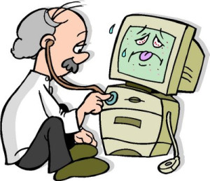

## Mejora el mantenimiento de tu sistema operativo Windows

Hay una máxima en ingeniería informática que afirma que el software no se desgasta, pero se deteriora. Cuando se acaba de instalar el **sistema operativo Windows el ordenador funciona a pleno rendimiento**; luego, se van instalando y actualizando programas a los que el usuario, ya sea consciente o inconscientemente, da permiso para modificar y configurar el **sistema operativo Windows**. El mantenimiento del PC es necesario porque estas configuraciones son las que, poco a poco, van deteriorando el sistema operativo, volviéndolo más lento e inestable.

Formatear el sistema operativo **el sistema operativo Windows es la solución** más efectiva para volver a disfrutar del ordenador como si fuera el primer día, haciendo un uso de los recursos limpio y rápido. Pero también se puede llevar a cabo un cuidado constante del ordenador que permita mantenerlo en un estado lo más parecido a cuando el usuario estrenó el aparato.

Algunas tareas que se realizan para el mantenimiento del PC son muy útiles para mejorar la integridad de los datos, aumentando la velocidad. Se puede, por ejemplo, hacer una limpieza del registro del sistema operativo Windows para eliminar y actualizar referencias a programas instalados. También es posible seleccionar los programas que se ejecutan al inicio y así obtener un sistema más estable y con un arranque más rápido. Otra tarea consiste en el escaneo del disco en busca de posibles errores o su desfragmentación, para organizar en el disco duro los datos de programas de forma contigua y que el acceso a ellos sea más rápido. L**impiar los archivos temporales de Internet, del sistema operativo Windows o de otros programas** también permite mejorar el rendimiento y la rapidez de las aplicaciones.

En definitiva, los principales motivos para realizar el mantenimiento del ordenador son volver a disfrutar de un ordenador ” como nuevo”, conseguir alargar su vida útil, subsanar todo tipo de problemas y errores y mejorar su rendimiento a todos los efectos, sobre todo en ordenadores con un **sistema operativo Windows ya que son los más susceptibles en acumular virus**.
