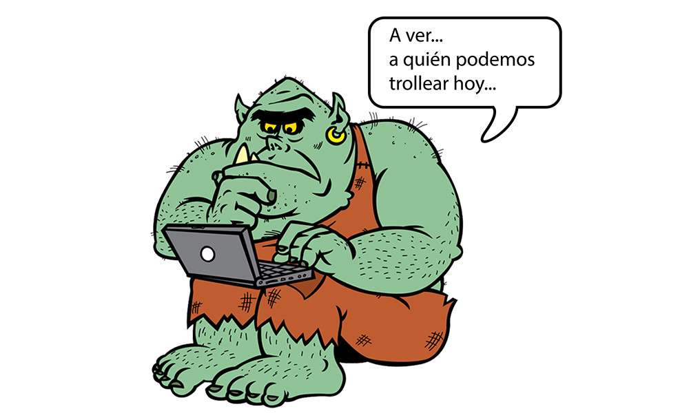

# [3 consejos para hacer frente a un troll en redes sociales](/blog/troll-en-redes-sociales)

El mayor problema que podemos tener teniendo presencia en RRSS es que, además de estar expuestos, cualquier persona tiene la posibilidad de comentar, de decir y opinar sobre lo que hacemos, ya sea para bien o para mal. No es nada raro recibir críticas de usuarios en nuestros perfiles de empresa y mucho menos es sorprendente encontrar algún que otro **troll en las redes sociales o incluso en nuestra web**

## ¿Qué es un troll en redes sociales?

Un **troll** es un **usuario de redes sociales** que, con el fin intencionado de provocar a la marca, **realiza** **críticas** sobre ella. Este tipo de críticas no son solo por una mala atención al cliente, un comentario negativo en uno de nuestros productos, sino que es más bien un ataque directo a la marca.

El término **troll** en redes sociales viene de la terminología del verbo inglés _troll_, que es una técnica de pesca en la que se usa el arrastre lentamente para que los peces piquen el anzuelo. Por lo tanto, el **troll** hace referencia a provoca a las marcas –con perfiles reales o no- haciendo **comentarios** irrelevantes, fuera de tema e incluso **ofensivos** en comunidades online.

Este tipo de usuarios suele destinar su tiempo en redes sociales, por lo general, desprestigiando marcas y haciendo que los detractores de la misma también actúen. Por eso, es muy importante que las marcas que tienen presencia en **rrss** tengan muy presente la existencia de este tipo de usuarios y sepan como actuar frente al **troll en redes sociales**.

## 3 pasos básicos para responder a un troll en redes sociales

Es muy normal que, si no tenemos experiencia o un _gabinete de situaciones de crisis_, no sepamos hacer frente a los comentarios y que lo resolvamos bloqueando al usuario. Os anunciamos que esto es lo último que tenemos que hacer ya que esto os dará más problemas que soluciones, al igual que os pasará si borráis el comentario hecho por el troll. [Aquí podéis contultar otros errores de gestión en redes sociales](/blog/redes-sociales-errores)

Para poder **hacerle frente al troll**, esto es lo que tenéis que hacer.

### Identifica al troll

Lo primero que hay que hacer cuando recibimos un comentario así es asegurarnos de que el comentario negativo lo ha realizado un troll y no un cliente descontento con alguno de los productos o servicios de la marca. Es importante hacerlo ya que, en estas situaciones, las reglas del juego cambian. Con los usuarios descontentos lo mejor es generar un buen feedback ofreciéndole una solución.

En el caso de que sea un **troll** deberemos asegurarnos de quién es y monitorizarlo a través de nuestras redes ya que dependiendo de qué tipo de usuario sea –influencer o usuario normal-, deberemos afrontarlo de una forma u otra. En el caso de que el troll en sea **[un influencer](http://www.40defiebre.com/que-es/influencer/)** deberemos ir con pies de plomo con nuestras respuestas ya que este tipo de usuarios suele tener muchos seguidores y por lo tanto mucha influencia en rrss –de ahí el nombre influencer-. Lo más importante es tener claro que contestarle es esencial, aunque las respuestas que le demos deberán ser comedidas, bastante objetivas y asertivas, y, por supuesto, deberán estar muy bien planteadas.

### Sé objetivo y transparente

No hay nada mejor que actuar con completa naturalidad con los **trolls**. “A palabras necias, oídos sordos” es algo que se aplica en este caso y los comentarios del **troll en redes sociales** no deben eliminarse ya que esto le empujará a seguir _trolleándonos_ y estaríamos mucho más expuestos a un “**[efecto Streisand](https://es.wikipedia.org/wiki/Efecto_Streisand)**”.

Lo mejor es tratar esto con la mayor naturalidad posible y contestar con respeto, educación y bajo un prima totalmente corporativo. Es cierto que algunos especialistas recomiendan no contestar a este tipo de mensajes provocativos y seguir con nuestra rutina habitual aunque no es del todo aconsejable. El hecho de que una marca no conteste a los comentarios del **troll** conlleva a que su comunidad también se vuelva en contra nuestra. Lo más recomendable es contestar, aunque no inmediatamente para no aumentar su ego y para ver cómo responde su comunidad. **Es importante no seguirle el juego en exceso**.

### No entres en confrontaciones con el troll en redes sociales

En las situaciones de lucha que se generan entre el **troll** y la marca en las rrss, tenemos que tener claro que siempre ganarán los usuarios ya que las redes sociales se basan y rigen por las normas de uso que ellos mismos generan. Si se trabaja de la manera correcta, es muy fácil que el **troll** pierda la fuerza en los comentarios ya que intentará comenzar una confrontación con la marca. Esto le hará perder la razón que puede haber ganado en algún momento de todo el proceso.

En el caso de que las provocaciones del **troll** comiencen a excederse – y como última opción- tenemos todo el derecho de bloquearlo y de denunciarle para que su cuenta sea revisada. Es importante que previo a esto, hayamos realizado todos los pasos anteriores ya que sino podemos caer en un bucle con malos comentarios hacia nuestra empresa.

Responder a un **troll** **en redes sociales** es muy sencillo, más incluso de lo que muchos piensan. Lo más importante es saber quiénes son y saber identificarlos en el momento y, sobre todo, no dejarnos influenciar de manera negativa por sus comentarios.
