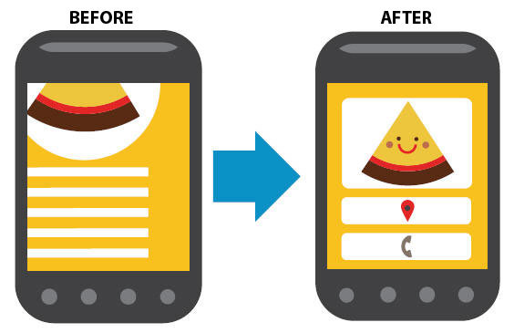

# Diseño web responsive y Mobile friendly
Con la llegada de las **nuevas tecnologías** y el aumento del uso de los dispositivos **móviles y tablets**, nos encontramos con un panorama muy diferente al que conocíamos. Ahora **las pantallas** ya no se limitan a unas medidas standard -13’’, 15’’ y 17’’- sino que **varían y cambian según el tamaño del smartphone** haciendo que haya una amplia gama de tamaños. Desde entonces, el uso y [**creación de páginas web**](https://www.gesdiweb.es/disseny-web-valencia/ "Diseño de páginas web en Valencia") que sean **responsive**, es decir capaces de responder en cualquier dispositivo, e**s esencial y mejora la experiencia del usuario,** por eso google lo tiene cada vez lo tiene mas en cuenta en el [posicionamiento en dispositivos móviles](https://www.gesdiweb.es/posicionamiento-web-valencia/), ya que hace bajar la tasa de rebote, aumentar el tiempo de permanencia en la web y ayuda fidelizar clientes.

## ¿Qué es el diseño responsive?
Este término proviene del inglés e **implica que los contenidos de toda web sean ajustables y se adapten para que se puedan ver en todos los dispositivos**. Vamos, que básicamente lo que se pretende es que una web se vea igual en una pantalla de un ordenador o de una tablet o smartphone, aunque por medio de [**css**](http://www.w3schools.com/css/ "css") se puede mostrar en distintas columnas o ocultar algún elemento

## ¿Por qué es importante que las web sean Mobile Friendly?
Hasta hace muy poco este tipo de cosas no se tenían en cuenta ya que las web se trabajaban y desarrollaban con HTLM o PHP, modelos de creación de diseños a medida. El hecho de que hayan nacido varias **plataformas de creación y diseño inteligente** –como por ejemplo **Prestashop o Wordprres,** ha hecho que todo el panorama cambie. **Google**, en su intención de hacerle la **vida más fácil al usuario**, ha decidido tener en cuenta este **parámetro** a la hora de **calcular y “puntuar”** las webs en su buscador.

Aunque es cierto que **Google aún no está penalizando** seriamente con esto –aunque sí que lo tiene muy en cuenta a la hora de posicionar las webs- está dando toques de atención a través de Google Webmaster Tools para que las webs se empiecen a trabajar desde la perspectiva **responsive** y **Mobile Friendly,** de hecho el [**día 21 de abril google decía que penalizía a dispositivos móviles**](https://www.gesdiweb.es/google-mobile-friendly-21-abril/) (no tablets ni pc) las palabras claves de las webs que no se ajustarán a sus criterios, aunque esto no ha sido del todo cierto es preciso que cuanto antes te tomes en serio el tema de la **usabilidad web**

¿Por qué? El hecho de que más del **50% del tráfico de Internet se realice a través de dispositivos móviles** y que casi el **30% de las compras también**, hace que **_Google_** tenga muy en cuenta este tipo de cosas y que si no se adapta, lo más seguro es que se empiecen a notar la bajada en las ventas.

## ¿Qué criterios usa Google para saber si una web es Mobile Friendly?
### No usa Flash
La tecnología Flash no está hecha para tablets o smartphones. Existen otras posibilidades como el **CSS o el javascript**.

### El texto se lee bien
No es necesario ajustar la pantalla al texto para poder leer el contenido. El texto debe **ajustarse al tamaño de los elementos**.

### Espacio entre enlaces
Los enlaces que existan en **la web deben estar separados** de forma correcta permitiendo al usuario navegar de la forma más **fácil y sencilla**. Si los links están demasiado cerca, Google lanza una alerta ya que el consumidor puede equivocarse por ello.

## Opciones para que una web sea Mobile Friendly
Cada web tiene un entorno y un estilo de desarrollo y diseño, es decir que cada una es de “su padre y de su madre” por lo que hay **varias opciones** que permiten a las webs –viejas y nuevas- ser **Mobile Friendly** y facilitar la navegación y la compra. Aquí dejamos **algunas opciones** para que una web se adapte al **Mobile Friendly**:

**Web Responsive**: el código de la web se va ajustando y variando según la pantalla en la que estemos viendo el contenido. El **código de la web es único** y útil en cualquier dispositivo.

**Web adaptativa**: aquí el **código de la web es diferente para cada dispositivo** –web, móvil o tablet- y se carga de una forma u otra según el dispositivo –y pantalla claro- en el que se visualice.

**Web única para móvil**: esto es más típico de las web “viejas” en las que el código se creó a “mano”. En este caso existe **una versión ordenador y otra móvil** con URLs diferentes, aunque perfectamente pueden estar redireccionadas.

Ya sabes que tu web debe adaptarse a todos los dispositivos existentes y que **Google tiene muy en cuenta si una web es Mobile Friendly** o no. Si no sabes si tu web es **Mobile Friendly o no**, ¡[consúltalo](https://www.google.com/webmasters/tools/mobile-friendly/)!

**Y tú, ¿te pasas al Mobile Friendly?** 

Para acabar te dejamos un artículo interesante de un compañero:

## [Bonus: Solventar los problemas de usabilidad en móviles](http://www.japavon.com/usabilidad-movil-google)
