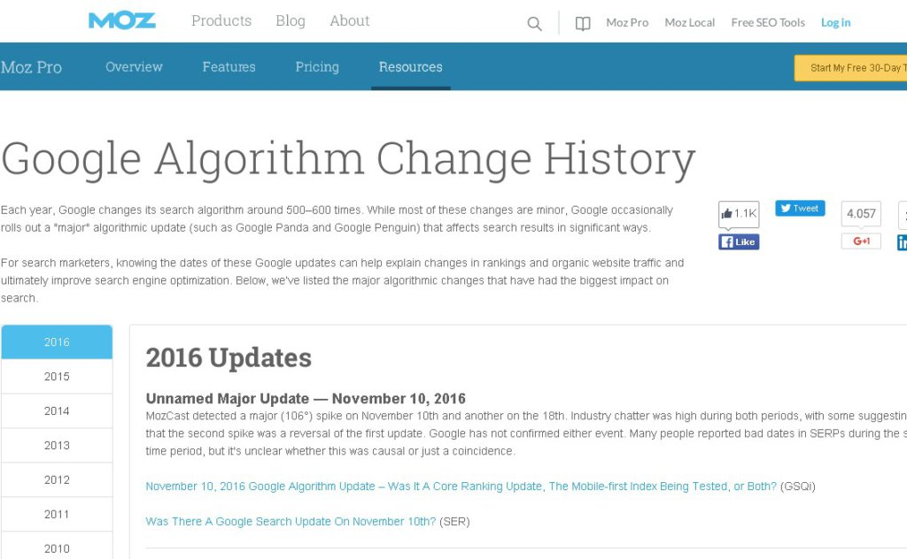

# Viralizar el contenido de tu blog es fácil con estos consejos
Recientemente, **un estudio de The New York Times** nos deslumbra sobre las razones que lleva a una persona a acceder al contenido de un blog y, más tarde, a compartirlo, haciéndolo de este modo viral a gran escala. Según este estudio, esto es **lo que piensan los usuarios**:

\-el **94%** analiza el contenido y si lo ve con valor o utilidad para los suyos, lo comparte.

–**73%** de los usuarios comparte contenido para conectar con personas con gustos parecidos.

\-el **49%** de los consumidores de contenido, lo hace para poder intercambiar opiniones y/o animar a otros a reaccionar.

Esto, obviamente, nos da una guía clara y concisa de por qué algunos creadores de contenido son más virales que otros, por qué tienen un mejor SEO y/o un número mayor de seguidores o interacciones. Este estudio es, en definitiva, lo que nos ha llevado a contaros qué hacer para viralizar el contenido de vuestro blog sin que os cueste un dineral.

## Consejos para viralizar el contenido de tu blog
Estos consejos te ayudarán a virarlizar los contenidos y [aumentar las visitas de tu blog](https://www.gesdiweb.es/aumentar-visitas-blog/)

### Actualiza tus contenidos siempre que puedas
Mucha gente cree que con postear un par de veces al mes es suficiente. Es suficiente si sabes cómo hacer que el bot de Google no detecte que llevas sin pasarte por tu blog desde hace días y que apenas generas contenido. Cuando **actualizas constantemente el contenido de tu blog**, consigues que la popularidad de tus otros post no decaiga, además republicar puede ayudarte a volver a subir posiciones de las palabras clave que tiene posicionadas este post, es una de las cosas que tiene en cuenta el algoritomo de Google que siempre esta en continua evolución

#### [Aquí puedes ver una cronología de todos los cambios que ha ido realizando google en su algoritmo de busqueda](https://moz.com/google-algorithm-change)

### Usa un plugin de “post relacionados”
Si utilizas wordpress hay plugins que te ponen las cosas mucho más fáciles de lo que crees. **Este plugin será tu mejor aliado para viralizar el contenido** que más te gusta y que crees que puede recorrer miles de ordenadores más rápido que la pólvora.

#### Plugin de post relacionados para wordpress

Aumentará el tiempo de permanencia en la página y las páginas visitadas. Intentar estudiar bien que categorías queréis crear y no crear millones etiquetas que no valen para nada

### Usa la newsletter
**El [email marketing](https://www.gesdiweb.es/email-marketing/) es una herramienta perfecta para viralizar el contenido**, por lo que vincular tus posts más populares y los nuevos en tu newsletter, ¡ayudará a que se viralicen!

Eso sí, es esencial que sepas cómo son tus subscritores y a quién le mandas dicha newsletter. Ten en cuenta que los hombres y las mujeres no tienen los mismos gustos, por ejemplo.

Además de esto, **añade en todas tus newsletters** redirecciones a tus redes sociales para **facilitarles** a tus lectores la faena de **sharing**.

### Publica tus posts fuera de tus zonas de confort
Estamos muy mal acostumbrados a trabajar los contenidos sobre todo lo que sabemos, sin importarnos que hay todo un mundo de experiencias y de conocimientos aún por descubrir. **Salirse de la zona de confort** es cada vez más complicado y esto les pasa a muchas marcas en el mundo online. Si algo les ha funcionado no cambian.

#### Comparte en redes sociales y grupos relacionados

**No solo utilices tus redes sociales**, crea alianzas con otros profesionales, participa en grupos, comparte tu contenido y el contenido de los demás y aumentará tu engachement . **No puedes pretender que la gente comparta tus cosas si tu no compartes** o que te sigan si tu no los sigues. Hay gente con mucha cara y saca pecho de que su visibilidad aumenta, pero tranquilos acaban siendo tirados de los grupos por spamers y se les ve el plumero.

Lo que nunca enseñan es su porcentaje de rebote o sus visitas referals de páginas rusas o indias. Posiblemente no sepan ni hacer vistas con filtros xD.

#### Utiliza Agregadores sociales
**Son una perfecta forma de compartir contenido** más allá de nuestra propia página en redes sociales, nuestra newsletter o lo que estemos usando.

Algunas **agregadores sociales** que utilizo personalmente y funcionan muy bien

##### [Marketing fan](http://mktfan.com/)

##### [Marketer top](http://www.marketertop.com/)

##### [Bitacoras](http://bitacoras.com/agregador/enviar)

### Reutiliza el contenido
A pesar de lo que te digan, reutilizar el contenido NO está mal. Si ya te ha **funcionado una vez para viralizar el contenido, ¿por qué no lo va a hacer de nuevo?** Ahí tienes tu propia respuesta.

Está claro que vas a tener que reestructurar el contenido, pero **usar la misma idea o keyword no te lo va a penalizar Google**, así que si sabes que eso es lo que le gusta a la gente, sigue haciéndolo.

### Transforma tu contenido
Dicen que vale más una imagen que mil palabras y esta frase, en el mundo de internet, tienen mucho más sentido del que esperamos los marketeros. El caso es que una **forma estupenda para viralizar el contenido es crear contenidos en un formato diferente para conseguir llevarlos al post de nuevo**.

Usa las inforgrafias, los PDF, los vídeos, los slideshare… ¡Hay un mundo de aplicaciones ahí fuera esperándote!

### Amplifica tu contenido
Sí, vale, Google cree que eres friendly a partir de las 350 palabras, pero… ¿lo eres para tus usuarios? **A veces estamos tan obcecados con el [SEO](https://www.gesdiweb.es/posicionamiento-en-buscadores/) que nos olvidamos de nuestros lectores.**

A pesar de lo que muchos se empeñan en decir, hacer mega guías – artículos de entre 1000 y 2000 palabras- atraerá mucho más público que si te decides a redactar constantemente entradas de 350-400 palabras.

Además de esto, **conseguirás posicionar mucho mejor la keywords long tail** –o sea las que tienen más de dos palabras-, optimizando así mucho mejor el tráfico a tu web o blog.

Realmente, **viralizar el contenido es mucho más sencillo** de lo que muchos se piensan. Solo hay que tener garbo, [saber sobre qué escribir en nuestro blog](https://www.gesdiweb.es/curacion-contenidos-blog/), y además saber cómo viralizarlo y difundirlo. Recuerda **que viralizar el contenido no tiene que pasar por avasallar a tus lectores sino que debes invitarlos a leerte**.
